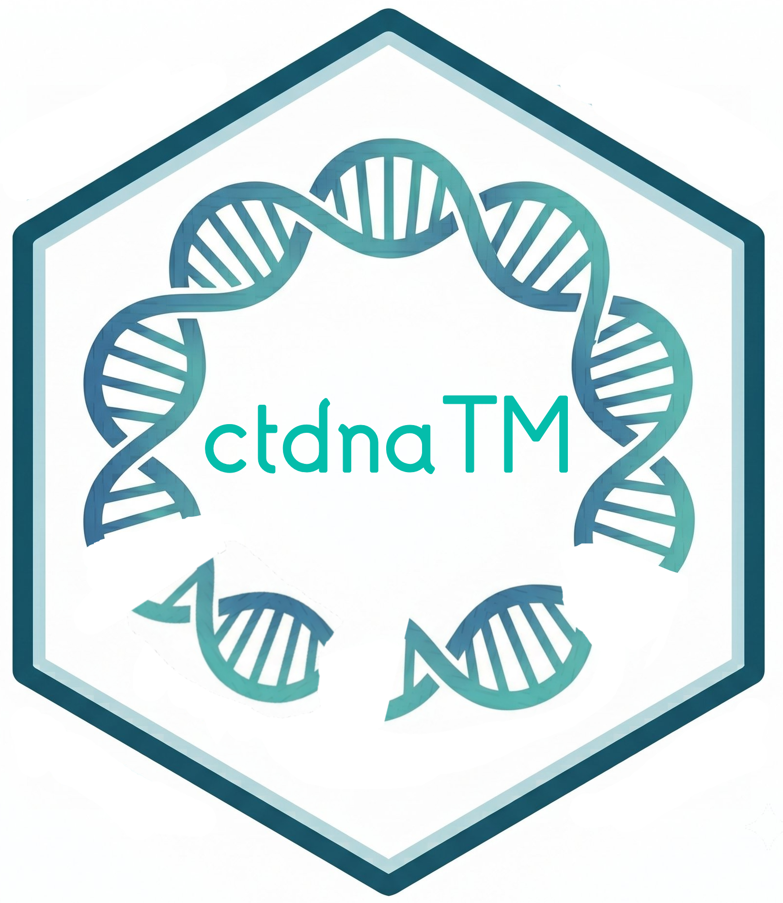

# ctdnaTM



Standardised plotting, statistics, and multi-modal integration helpers for
the core ctDNA deliverables. Built around the Guardant Health Infinity
platform, extensible to other vendors and to orthogonal tissue-genomic
data (WES / WGS / panel) and RNAseq.

## Install

Local tarball:

```r
install.packages("path/to/ctdnaTM_0.75.10.tar.gz", repos = NULL,
                 type = "source")
```

Dependencies pulled from CRAN automatically: `ggplot2`, `tidyr`, `rlang`,
`scales`, `patchwork`, `ggnewscale`, `grid`, `httr`, `jsonlite`.
Optional: `RColorBrewer` (nicer default annotation colors), `data.table`
(faster reads on large tissue trees), `ComplexHeatmap` (alternate oncoprint
backend).

## Quick tour

```r
library(ctdnaTM)

# Assemble the prep object
prep <- ctdna_prepare(
  infinity_report = my_infinity_csv,
  clinical        = my_clinical,
  dnaseq          = list(loc = "/mnt/wes/", regex = "*/*.clinical.annotated.tsv"),
  verbose         = TRUE)

# Landscape / trajectory plots — every plot function accepts an `indications`
# arg for cohort restriction
ctdna_plot_baseline(prep$ctdna, indications = "NSCLC")
ctdna_plot_reduction(prep$ctdna, indications = c("mCRPC","NSCLC"))
ctdna_plot_oncoprint(prep$variants,
                     gene_sets   = list(TSG = c("TP53","RB1","PTEN"),
                                        HRR = c("BRCA1","BRCA2","ATM")),
                     indications = "mCRPC")

# ctDNA vs tissue concordance oncoprint
res <- ctdna_concordance_oncoprint(
  prep,
  tissue_df   = prep$dnaseq,
  gene_sets   = list(Cancer_50 = cancer_50),
  visit       = "baseline",
  wrap        = "Indication",
  indications = c("mCRPC","NSCLC"),
  annotations = c("Dose","RECIST"),
  title       = "ctDNA vs tissue concordance")

# res is a ggplot — add layers directly
res + ggplot2::theme(axis.text = ggplot2::element_text(size = 6))
```

## Documentation

- **`vignette("ctdnaTM_walkthrough")`** — end-to-end tutorial
- **`vignette("ctdnaTM_function_tour")`** — every function with examples
- **`vignette("ctdnaTM_filter_internals")`** — filter engine deep dive
- **`?ctdna_prepare`, `?ctdna_concordance_oncoprint`** and the rest — full
  argument-by-argument docs

## Version

Current release: **v0.75.10**. See `NEWS.md` for changes.
