# ctdnaTM

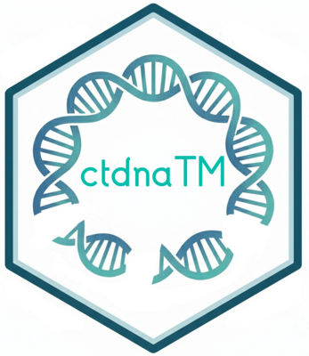

> **⚠️ MOCK DATA THROUGHOUT — READ BEFORE USING ANY OUTPUT**
>
> Every dataset, indication name, cohort structure, and figure in
> this README is generated by `ctdna_make_mock_study()`. Nothing
> here is derived from any real clinical study. Indication labels
> (`Tumor_A`, `Tumor_B`, `Tumor_C`, `Tumor_D`, `Tumor_E`) are
> synthetic placeholders — they do not represent any specific
> cancer type or patient population. Gene alteration frequencies,
> RECIST distributions, and dose-response patterns are simulated
> and should not be interpreted as biological or clinical
> findings.

Standardised analysis, plotting, and multi-modal integration for
ctDNA translational-medicine deliverables. Built around the
Guardant Health Infinity platform, extensible to other vendors.

The package ingests a vendor delivery (variants, tumour-fraction
changes, panel frames, methylation, ADaM clinical, IHC, tissue
DNA-seq, RNA-seq), assembles it into a single `ctdna_prep`
object, and produces the eleven core deliverables — baseline
distributions, on-treatment trajectories, cross-modality
comparisons, genomic-landscape oncoprints — with a programmable
filter grammar for variant selection, ComplexHeatmap-based
concordance views, and bundled statistical helpers.

Every code chunk in this README is verified end-to-end on the
built-in mock (`ctdna_make_mock_study(n_patients = 300, seed =
42)`). Paste it into a clean R session and you'll reproduce every
figure exactly.

---

## Table of contents

- [Install](#install)
- [Quick start](#quick-start)
- [Working with indications](#working-with-indications)
- [Splitting arguments](#splitting-arguments)
- [`ctdna_subset()`](#ctdna_subset)
- [1. Data ingestion and prep](#1-data-ingestion-and-prep)
  - [1a. Building the study bundle](#1a-building-the-study-bundle)
  - [1b. Assemble prep and apply variant filter](#1b-assemble-prep-and-apply-variant-filter)
  - [1c. Sample QC and removal tracking](#1c-sample-qc-and-removal-tracking)
- [2. `ctdna_plot_baseline()` — all variations](#2-ctdna_plot_baseline--all-variations)
- [3. `ctdna_plot_reduction()` — all variations](#3-ctdna_plot_reduction--all-variations)
- [4. `ctdna_plot_longitudinal()` and `longitudinal_stats()`](#4-ctdna_plot_longitudinal-and-longitudinal_stats)
- [5. `ctdna_concordance()` — categorical / ordinal concordance](#5-ctdna_concordance--categorical--ordinal-concordance)
- [6. The comparison trio — scatter and boxplot](#6-the-comparison-trio--scatter-and-boxplot)
- [7. Genomic landscape](#7-genomic-landscape)
  - [7a. Oncoprint](#7a-oncoprint)
  - [7b. Alteration grid](#7b-alteration-grid)
  - [7c. Pipeline — one call, every deliverable](#7c-pipeline--one-call-every-deliverable)
  - [7d. Filter-scheme catalog and visualisation](#7d-filter-scheme-catalog-and-visualisation)
  - [7e. Tissue DNA-seq and concordance oncoprint](#7e-tissue-dna-seq-and-concordance-oncoprint)
- [Statistical helpers](#statistical-helpers)
- [Configuration — `ctdna_opts()`](#configuration--ctdna_opts)
- [Rule predicates catalog](#rule-predicates-catalog)
- [Migrating from 0.77.x](#migrating-from-077x)
- [Where to go next](#where-to-go-next)
- [Bug reports](#bug-reports)

---

## Install

**From GitHub (recommended):**

```r
# install.packages("remotes")
remotes::install_github("nikleotide/ctdnaTM")
```

**From a local tarball (offline / release-pinned):**

```r
install.packages("path/to/ctdnaTM_0.81.0.tar.gz",
                 repos = NULL, type = "source")
```

**ComplexHeatmap is required** for `ctdna_oncoprint()` and
`ctdna_concordance_oncoprint_core()`. Install from Bioconductor:

```r
install.packages("BiocManager")
BiocManager::install("ComplexHeatmap")
```

The rest of the plot family (`ctdna_plot_baseline`,
`ctdna_plot_reduction`, `ctdna_plot_longitudinal`,
`ctdna_concordance`, `ctdna_plot_scatter`, `ctdna_boxplot`,
`ctdna_alteration_grid`) is pure ggplot2 and needs no extra
dependency beyond CRAN.

---

## Quick start

Paste-and-run block. Every later section reuses this `prep`:

```r
library(ctdnaTM)
library(ComplexHeatmap)   # needed for oncoprint / concordance oncoprint
library(circlize)         # ComplexHeatmap companion

sim <- ctdna_make_mock_study(n_patients = 300, seed = 42)

# Rename the mock's indication labels to synthetic placeholders
# (`Tumor_A` … `Tumor_E`) and supply them under the lower-case
# spelling `indication`, which ctdna_prepare() canonicalises to
# `Indication`.
imap <- c(BRCA = "Tumor_A", CRC = "Tumor_B", GBM = "Tumor_C",
          NSCLC = "Tumor_D", mCRPC = "Tumor_E")
sim$clinical$indication <- unname(imap[sim$clinical$Cancertype])
sim$clinical$Cancertype <- NULL

prep <- ctdna_prepare(
  infinity_report                       = sim$infinity_report,
  tf_change                             = sim$tf_change,
  `74_genomic_panel`                    = sim$panel_74_response,
  `500_genomic_panel`                   = sim$panel_500_response,
  Methylation_GuardantResponseRUOReport = sim$methylation_response,
  adam                                  = list(adsl = sim$clinical,
                                               adtr = sim$adtr),
  ihc                                   = sim$ihc,
  dnaseq                                = sim$dnaseq,
  rnaseq                                = sim$rnaseq)

prep <- ctdna_sample_qc(prep)

# Cap the two long-tailed ctDNA columns so extreme simulated
# progressors don't dominate the visible range in the trajectory
# plots. Real ctDNA data has the same long tail; on your own
# study, adjust or omit.
prep$samples$Ctdna_percentage_change <- pmax(pmin(
  prep$samples$Ctdna_percentage_change, 200), -100)
prep$samples$Methylation_tumor_fraction_percentage <- pmin(
  prep$samples$Methylation_tumor_fraction_percentage, 20)

prep <- ctdna_variant_filter(prep,
          filter_scheme = c("TSG_Tier2", "HRR14", "scheme_basic"),
          apply         = TRUE,
          explain       = TRUE)

res  <- ctdna_pipeline(prep)   # produces the 11 core deliverables
```

---

## Working with indications

Multi-cohort studies are first-class in 0.78.0. There are three
ways to work with cohorts, and they compose freely.

### The canonical `Indication` column

`ctdna_prepare()` folds any of the following input column names
into a single canonical `Indication` column:

```
Indication, indication, INDICATION, disease, Disease,
Cancer_type, cancer_type, CANCER_TYPE, TUMTYPE, tumtype,
Tumor_type, TumorType
```

That canonical column is written to **both** `prep$clinical`
**and** `prep$samples`, so every function in the package can see
it. Which name the package looks for is configurable:

```r
ctdna_opts("indication")     # -> "indication"  (the default)
ctdna_opts(indication = "MyCohortCol")   # point it somewhere else
```

**Both the column name and the values you pass are matched
loosely**, so you never have to remember the exact spelling used
upstream:

* **Column name** — `indication`, `Indication`, `INDICATION`,
  `cancer_type`, `Cancer-Type` and any other case/separator
  variant all resolve to whichever spelling your data actually
  uses.
* **Values** — matching ignores case and separators, so
  `"Nsq-NSCLC"`, `"nsq_nsclc"`, `"NSQ.NSCLC"` and `"nsq nsclc"`
  all match a stored `"Nsq_NSCLC"`.

If a value matches nothing, you get an immediate error listing
what *is* available, rather than an empty result and a confusing
downstream failure:

```r
ctdna_plot_baseline(prep, measure = "methyl", indication = "Totally_Made_Up")
#> Error: indication: none of {Totally_Made_Up} matched any value in `Indication`.
#>   Available: ES_SCLC, HNSCC, Nsq_NSCLC, mCRPC
#>   Matching ignores case and separators, so "es-sclc" would match "ES_SCLC".
#>   Pass indication = NULL (the default) to use every indication.
```

Confirm the join worked before plotting:

```r
"Indication" %in% names(prep$samples)      # should be TRUE
table(prep$samples$Indication, useNA = "ifany")
```

If this is `FALSE`, your clinical frame had no recognisable
indication column. Add one (any spelling from the list above)
and re-run `ctdna_prepare()`.

### 1 — Group or facet *by* indication

Any function that takes `group_by`, `subgroup_by`, `facet`,
`wrap`, or `x` accepts the indication column. Both the canonical
`"Indication"` and the opts-resolved `"indication"` work:

```r
ctdna_plot_baseline(prep, measure = "methyl", group_by = "indication")
```

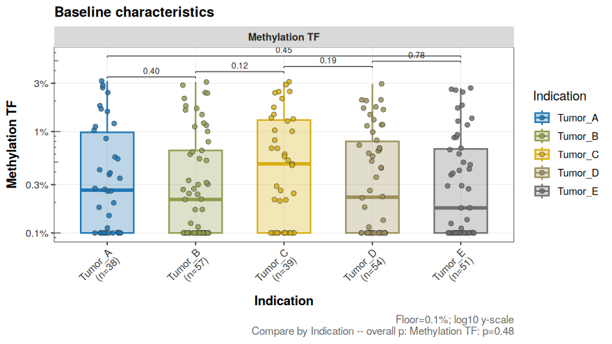

```r
ctdna_plot_longitudinal(prep, group_by = "RECIST", facet = "Indication")
```

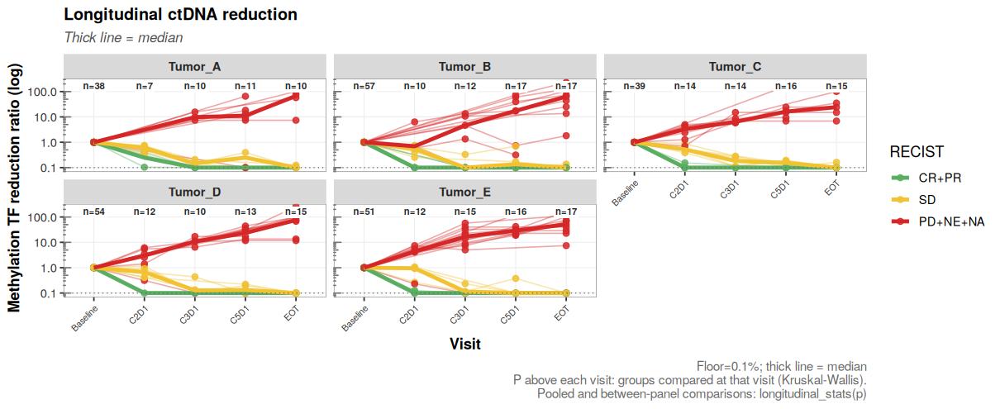

```r
ctdna_boxplot(prep, y = "methyl", x = "Indication",
              y_scale = "log10", point_alpha = 0.3)
```

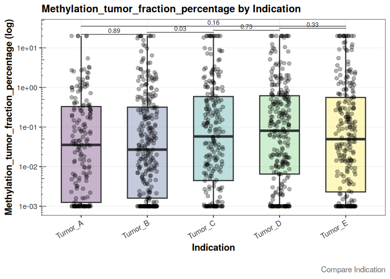

### 2 — Restrict *to* one or more indications

Every user-facing function now takes `indication =`. Pass a
single string or a character vector. **`NULL` — the default —
means every indication**, so leaving the argument off never
silently narrows your analysis:

```r
# one cohort
ctdna_plot_baseline(prep, measure = "methyl", indication = "Tumor_D")

# several cohorts
ctdna_plot_baseline(prep, measure = "methyl", group_by = "Dose",
                    indication = c("Tumor_A", "Tumor_D"))
```

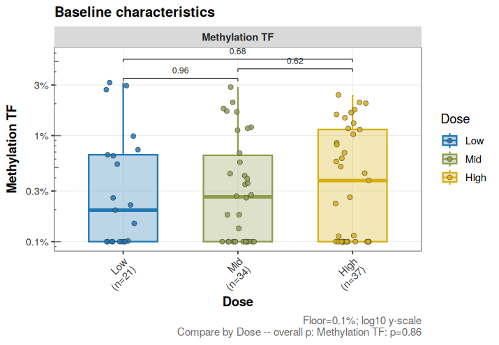

The restriction cascades to every prep slot that carries a
`Patient_ID`, so variants, assessments, IHC, DNA-seq and RNA-seq
are all subset consistently — the statistics and the per-group
`n` labels reflect the restricted cohort, not the full study.

Functions that accept `indication =`:

| Family | Functions |
|:--|:--|
| Trajectory | `ctdna_plot_baseline`, `ctdna_plot_reduction`, `ctdna_plot_longitudinal`, `ctdna_plot_pct_change_by_dose_time` |
| Comparison trio | `ctdna_plot_scatter`, `ctdna_boxplot`, `ctdna_concordance` |
| Cross-modality | `ctdna_plot_vs_tmb`, `ctdna_plot_vs_ihc`, `ctdna_plot_vs_expression`, `ctdna_plot_vs_mutation` |
| Landscape | `ctdna_oncoprint`, `ctdna_alteration_grid`, `ctdna_concordance_oncoprint_core` |
| Orchestration | `ctdna_pipeline` |

### 3 — Combine both

Restriction and grouping are independent, so you can subset to a
few cohorts and still split by another variable — or subset and
group by indication to compare only the cohorts you care about:

```r
ctdna_plot_reduction(prep, scheme = "three",
                     group_by    = "Dose",
                     subgroup_by = "RECIST",
                     indication  = c("Tumor_A", "Tumor_B", "Tumor_D"))
```

### Loop vs. vector

`indication =` takes a vector, so a single call covers several
cohorts on one set of axes. When you want **one figure per
cohort** — which is usually what you want for oncoprints, where
patients are the columns — loop and pass one value per
iteration:

```r
for (ind in c("Tumor_A", "Tumor_B", "Tumor_D")) {
  print(ctdna_oncoprint(prep,
          gene_sets     = list(TSG = c("TP53","PTEN","CDKN2A")),
          filter_scheme = "scheme_basic",
          visit         = "baseline",
          indication    = ind,
          title         = paste("Landscape --", ind)))
}
```

---

## Splitting arguments

Every plot can be split along several dimensions at once. The
arguments are consistent across the package:

| Argument | Effect | Accepts |
|:--|:--|:--|
| `group_by` | x-axis grouping | **one** column |
| `subgroup_by` | colour-coded second dimension *within* each group | **one** column |
| `facet` | separate panels | one column (some functions take two for a grid) |
| `wrap` | **alias for `facet`** — identical behaviour | same as `facet` |
| `indication` | **filter**, not a display dimension — which patients are analysed | string or vector |
| *(see `ctdna_subset()`)* | filter once, reuse the subset across many calls | — |

`facet` and `wrap` are interchangeable on every function as of
0.79.0. Use whichever you remember; if you pass both and they
differ, `facet` wins and a message says so.

| Function | Panelling | Notes |
|:--|:--|:--|
| `ctdna_plot_baseline`, `_reduction` | `facet` / `wrap` | plus `group_by` + `subgroup_by` |
| `ctdna_plot_longitudinal` | `facet` / `wrap` | accepts a length-2 vector for a grid |
| `ctdna_plot_scatter` | `facet` / `wrap` | plus `color_by`, `shape_by` |
| `ctdna_boxplot` | `facet` / `wrap` | plus `x`, `color_by` |
| `ctdna_concordance` | `facet` / `wrap` | **new in 0.79.0** |
| `ctdna_oncoprint`, `ctdna_alteration_grid`, `ctdna_concordance_oncoprint_core` | `wrap` / `facet` | |

### `group_by` takes one column

`group_by` is the x-axis, so it takes a single column. Passing a
vector now tells you what to use instead:

```r
ctdna_plot_baseline(prep, measure = "methyl",
                    indication = c("Nsq_NSCLC","HNSCC"),
                    group_by   = c("Dose","Indication"))
#> Error: `group_by` must be a single column. You passed 2: "Dose", "Indication".
#>   For a second dimension use one of:
#>     subgroup_by = "Indication"   (colour-coded within each group_by group)
#>     facet       = "Indication"   (separate panels; `wrap` is an alias)
#>   e.g. group_by = "Dose", subgroup_by = "Indication"
```

### Several indications, one with multiple doses

This is the common multi-cohort case: you want a few cohorts, and
at least one of them has more than one dose level. Three ways to
lay it out, all equivalent in data, different in emphasis:

```r
IND <- c("Nsq_NSCLC", "HNSCC")

# cohort as colour within each dose
ctdna_plot_baseline(prep, measure = "methyl", indication = IND,
                    group_by = "Dose", subgroup_by = "Indication")

# dose as colour within each cohort
ctdna_plot_baseline(prep, measure = "methyl", indication = IND,
                    group_by = "Indication", subgroup_by = "Dose")

# one panel per cohort
ctdna_plot_baseline(prep, measure = "methyl", indication = IND,
                    group_by = "Dose", facet = "Indication")
```

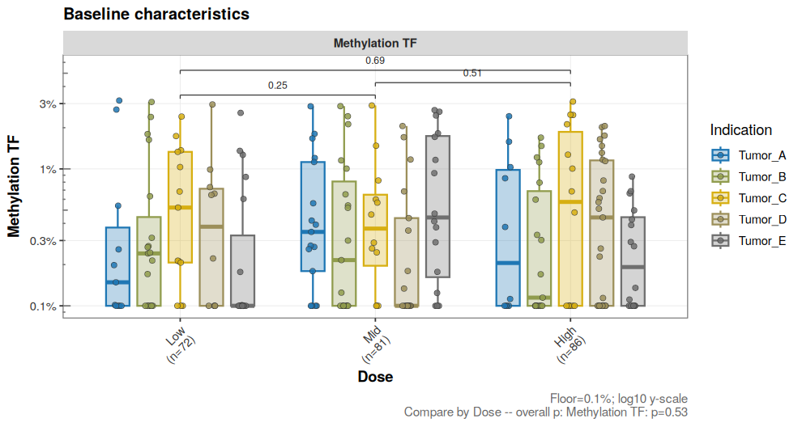

If a cohort has no patients at a given dose, that cell is simply
empty — that is real, not a rendering fault.

You can use all three at once:

```r
ctdna_plot_baseline(prep, measure = "methyl", indication = IND,
                    group_by    = "Dose",
                    subgroup_by = "RECIST",
                    facet       = "Indication")
```

---

## `ctdna_subset()`

Carve a prep down to what you want to analyse. The result is a
`ctdna_prep` with the **same class, same slots and same columns**
as the input — only the number of records changes — so it drops
straight into every plotting and analysis function.

```r
nsclc <- ctdna_subset(prep, indication = "Nsq_NSCLC")

ctdna_plot_baseline(nsclc, group_by = "Dose", subgroup_by = "RECIST",
                    compare_by = "subgroup_within_group", pairwise = TRUE)
ctdna_plot_reduction(nsclc, scheme = "three")
ctdna_oncoprint(nsclc, gene_sets = list(TSG = c("TP53","PTEN")))
ctdna_pipeline(nsclc)
```

That is the cleanest answer when `group_by` and `subgroup_by` are
already occupied and you still want a specific cohort: subset
first, then plot.

### Dimensions

**Patient-level** — resolves a set of `Patient_ID`s and cascades
to *every* slot carrying a `Patient_ID`, so variants,
assessments, IHC, DNA-seq and RNA-seq stay in step with
`$samples` and `$clinical`. Statistics and per-group `n` labels
reflect the subset, not the full study.

| Argument | Keeps |
|:--|:--|
| `indication` | cohort label(s) |
| `dose` | dose level(s) |
| `recist` | best-response category(ies); pass `scheme=` to match collapsed labels |
| `mr` | molecular-response call(s) |
| `patient` | explicit `Patient_ID` vector (matched exactly — IDs are case-significant) |

**Row-level** — filters rows inside the frames that carry the
column. Patients are **not** dropped; one with no matching rows
just contributes nothing to that frame.

| Argument | Filters |
|:--|:--|
| `visit` | per-visit frames (`$samples`, `$variants`, `$assessments`) |
| `gene` | `$variants` and `$dnaseq` |

### Combining

Arguments are **AND-ed**:

```r
ctdna_subset(prep, indication = c("Nsq_NSCLC","ES_SCLC"), dose = "8 mg/kg")
ctdna_subset(prep, indication = "ES_SCLC", recist = "PD")
ctdna_subset(prep, recist = "PD+NE+NA", scheme = "three")
ctdna_subset(prep, indication = "HNSCC", visit = "baseline")
ctdna_subset(prep, gene = c("TP53","PTEN","RB1"))
```

`verbose = TRUE` (the default) prints what was kept:

```
ctdna_subset: 240 -> 40 patient(s), 915 of 5635 row(s) across prep slots.
  kept: indication={Nsq_NSCLC,ES_SCLC}; dose={High}
```

### Matching and errors

Every value is matched **case- and separator-insensitively**, the
same rule `indication =` uses:

```r
ctdna_subset(prep, indication = "nsq-nsclc")   # matches "Nsq_NSCLC"
ctdna_subset(prep, dose       = "8mg/kg")      # matches "8 mg/kg"
```

`visit = "baseline"` resolves to each frame's **first visit
level**, which matters because vocabularies differ between frames
— `$samples` carries normalised labels (`Baseline`) while
`$variants` keeps the raw protocol labels (`C1D1`).

A value matching nothing errors with the available values listed;
a combination matching nobody says so explicitly:

```r
ctdna_subset(prep, indication = "Nope")
#> Error: ctdna_subset: none of {Nope} matched any value in `Indication` (from $clinical).
#>   Available: ES_SCLC, HNSCC, Nsq_NSCLC, mCRPC
#>   Matching ignores case and separators.

ctdna_subset(prep, indication = "HNSCC", dose = "6 mg/kg")
#> Error: ctdna_subset: the combined restriction matched 0 patients.
#>   Relax one of the arguments (they are AND-ed together).
```

### Pooled-cohort notice

When a prep spans two or more indications and indication is not a
display dimension, plots append a line to the caption so a pooled
figure can't be mistaken for a single-cohort one:

```
Note: 4 indications pooled (ES_SCLC, HNSCC, Nsq_NSCLC, mCRPC)
```

It is omitted when the prep holds one cohort (e.g. after
`ctdna_subset()`) or when indication is already on `group_by` /
`subgroup_by` / `facet` / `x` / `color_by`. Suppress globally with
`ctdna_opts(warn_pooled_dims = FALSE)`.

---

## 1. Data ingestion and prep

### 1a. Building the study bundle

**In production**, a study bundle assembles from ADaM datasets
(`adrs`, `adsl`, `adtr` read via `haven::read_sas()` from the
study SDTM/ADaM tree) and the Guardant Health Infinity vendor
delivery (`InfinityReport.csv` / `CoreReport.csv` walked out of
the Production folder with `fs::dir_ls()`). The `Patient_ID`
column is left-padded to six digits so it joins cleanly with the
ADaM `SUBJID`. Cohort tagging (`indication`, `indication_dose`)
is added via `dplyr::mutate()` before aggregation — and as of
0.78.0 that `indication` column is carried all the way through
to `prep$samples`.

For a reproducible, self-contained walkthrough, the same
canonical shape is available from the built-in mock generator:

```r
sim <- ctdna_make_mock_study(n_patients = 300, seed = 42)
names(sim)
# [1] "infinity_report"     "tf_change"           "panel_74_response"
# [4] "panel_500_response"  "methylation_response" "clinical"
# [7] "adtr"                "ihc"                  "dnaseq"
# [10] "rnaseq"
```

The mock yields a 300-subject bundle with five synthetic
indications (`Tumor_A` … `Tumor_E` after the rename step in the
quick start), three dose levels (Low / Mid / High), five
on-treatment visits (Baseline, C2D1, C3D1, C5D1, EOT), plasma
coverage across 20 canonical ctDNA-panel genes, tissue DNA-seq
across 40 genes, and simulated RECIST + methylation
trajectories.

### 1b. Assemble prep and apply variant filter

`ctdna_prepare()` is the single entry point. Pass whichever
modality frames you have; each optional argument is quietly
skipped if `NULL`. The function canonicalises column names,
merges the ADaM clinical, applies the `dnaseq` dictionary to any
tissue DNA-seq inputs, and returns a `ctdna_prep` object:

```r
prep <- ctdna_prepare(
  infinity_report                       = sim$infinity_report,
  tf_change                             = sim$tf_change,
  `74_genomic_panel`                    = sim$panel_74_response,
  `500_genomic_panel`                   = sim$panel_500_response,
  Methylation_GuardantResponseRUOReport = sim$methylation_response,
  adam                                  = list(adsl = sim$clinical,
                                               adtr = sim$adtr),
  ihc                                   = sim$ihc,
  dnaseq                                = sim$dnaseq,
  rnaseq                                = sim$rnaseq,
  verbose                               = TRUE)

prep                # frame dimensions + QC counts
prep$dictionary     # confirm columns were canonicalised
```

`ctdna_variant_filter()` applies one or more named schemes to
`prep$variants`. Two mandatory flags control what happens:

- **`apply = TRUE`** → drop failing variants from
  `prep$variants`.
- **`explain = TRUE`** → store an annotated snapshot on
  `prep$filter_explanation$<scheme>` including the filtering
  criteria, per-variant pass/fail decisions, and the
  branch/rule the decision came from.

Both default to `FALSE` (report-only mode), so you can preview a
scheme before committing to it:

```r
prep <- ctdna_variant_filter(prep,
          filter_scheme = c("TSG_Tier2", "HRR14", "scheme_basic"),
          apply         = TRUE,
          explain       = TRUE)

# inspect what got kept and why
head(prep$filter_explanation$TSG_Tier2$filtering_criteria)
```

### 1c. Sample QC and removal tracking

`ctdna_sample_qc(prep)` runs sample-level QC on `prep$samples`
and cascades to `prep$variants` so downstream filters do not see
variants from dropped samples. It is idempotent — calling twice
does nothing new. Thresholds come from `ctdna_opts()`; override
per call as needed.

Everything sample QC removed lives on `prep$qc_removed` — useful
for audit and to justify per-cohort n.

```r
# rows removed by prepare's built-in QC
sapply(prep$qc_removed, function(x) if (is.null(x)) 0L else nrow(x))

# standalone re-run with explicit thresholds
prep <- ctdna_sample_qc(prep, plasma_min = 0, cfdna_min = 0, verbose = TRUE)
```

---

## 2. `ctdna_plot_baseline()` — all variations

Distribution of baseline ctDNA quantities by group / subgroup
with optional pairwise significance tests.

### 2a. `measure` — which quantity

Every ctDNA quantity can be plotted individually, or all together
in one faceted view. `measure = "custom"` reads any numeric
column you name.

```r
ctdna_plot_baseline(prep, measure = "methyl")     # Methylation TF (default)
ctdna_plot_baseline(prep, measure = "maxvaf")     # max VAF
ctdna_plot_baseline(prep, measure = "meanvaf")    # mean VAF
ctdna_plot_baseline(prep, measure = "all")        # all three in one plot
ctdna_plot_baseline(prep, measure = "custom",
                    value_col = "Mean_VAF_percentage")
```

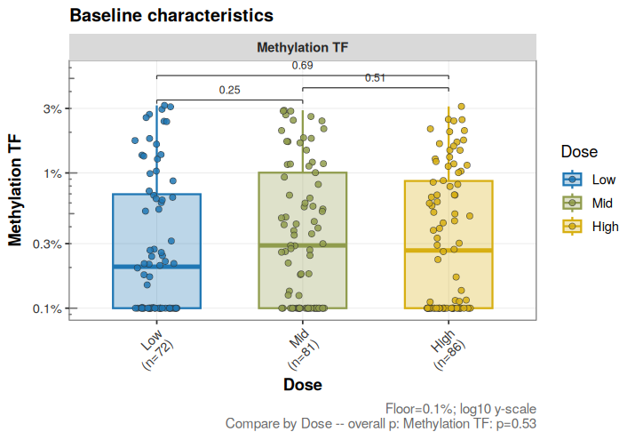

The `measure = "all"` variant produces a three-panel faceted
view:

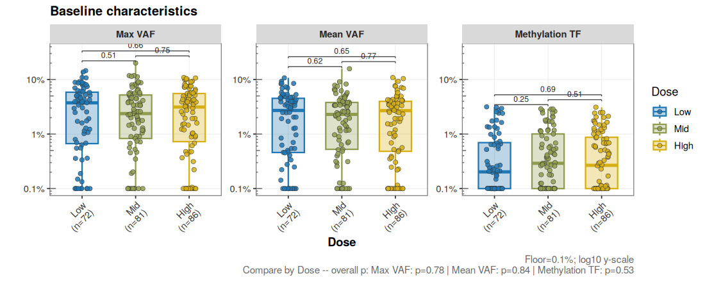

> **Note on the two figures above.** `indication` is unset, so
> **every indication is pooled**. The `n = 72 / 81 / 86` labels
> are the totals across all five cohorts (38 + 57 + 39 + 54 + 51
> = 239), split only by `Dose`. Cohort membership is collapsed,
> not filtered — nothing is dropped. To make cohort a visible
> dimension use `group_by = "Indication"`; to analyse a subset
> use `indication = c(...)`. See
> [Working with indications](#working-with-indications).

### 2b. `group_by` / `subgroup_by` — cohort dimensions

`group_by` sets the top-level x-axis grouping; `subgroup_by` adds
a colour-coded second dimension. Both accept `"Indication"`.

```r
ctdna_plot_baseline(prep, group_by = "Dose", measure = "methyl")
ctdna_plot_baseline(prep, group_by = "Dose",
                    subgroup_by = "RECIST", measure = "methyl")
```

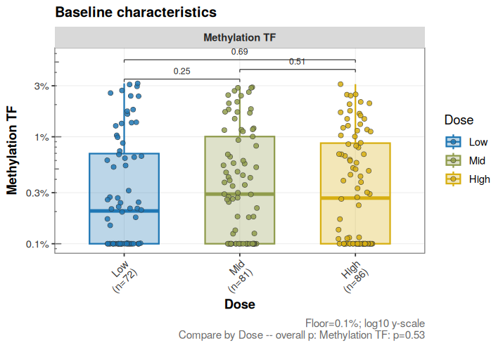

Grouped + subgrouped:

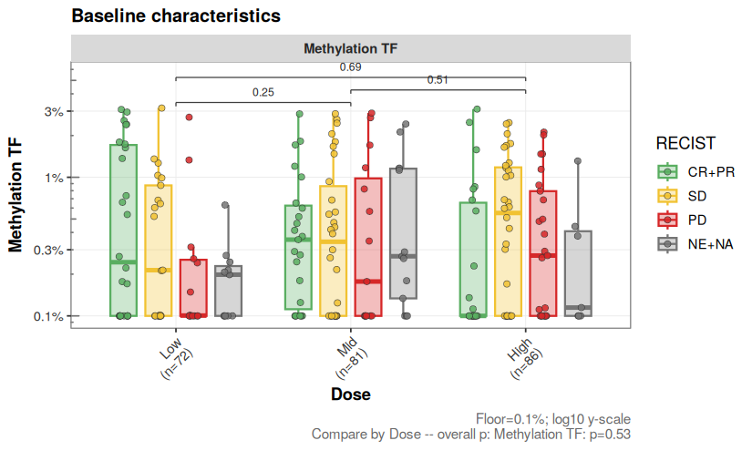

### 2c. `compare_by` — statistical comparison scope

Four modes:

- `"group"` — between top-level groups
- `"subgroup"` — between subgroups, ignoring group
- `"subgroup_within_group"` — subgroup pairs within each group
- `"group_within_subgroup"` — group pairs within each subgroup

```r
ctdna_plot_baseline(prep, group_by = "Dose", subgroup_by = "RECIST",
                    compare_by = "subgroup_within_group",
                    measure = "methyl")
```

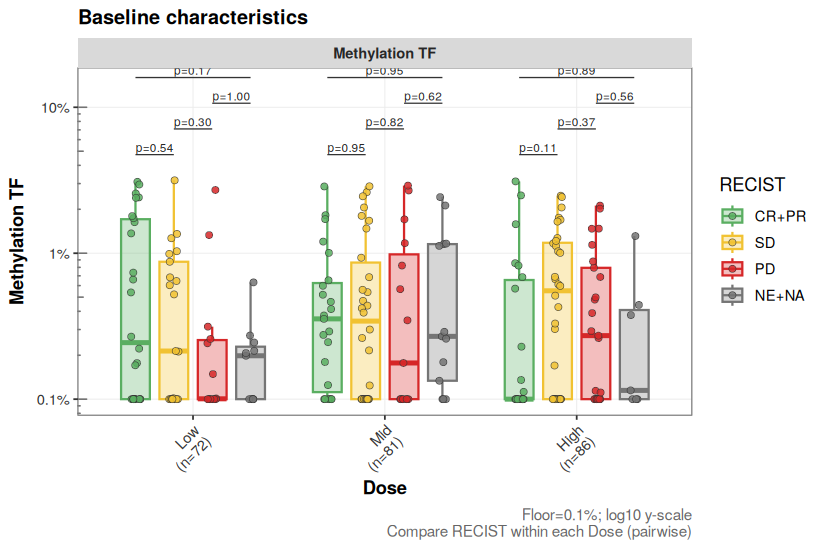

### 2d. `pairwise`, `p_adjust`, and axis controls

`pairwise = TRUE` shows every pair; `FALSE` shows one omnibus p
per panel. `p_adjust` accepts `FALSE` (raw p), `TRUE`
(Benjamini-Hochberg), or a named method — `"Holm"`,
`"bonferroni"`, `"BY"`, etc. `y_scale` toggles axis transform
(`"log10"` default, `"linear"`, `"fixed"`); `scales` controls
per-facet axis behaviour (`"free_y"`, `"fixed"`); `drop_na =
FALSE` keeps NA-valued rows visible.

```r
ctdna_plot_baseline(prep, group_by = "Dose", subgroup_by = "RECIST",
                    compare_by = "subgroup_within_group",
                    pairwise   = FALSE, measure = "methyl")

ctdna_plot_baseline(prep, group_by = "Dose", subgroup_by = "RECIST",
                    compare_by = "subgroup_within_group",
                    p_adjust   = "Holm", measure = "methyl")

ctdna_plot_baseline(prep, measure = "all", y_scale = "fixed")
ctdna_plot_baseline(prep, measure = "all", scales  = "free_y")
```

### 2e. `indication` — restrict to cohorts

```r
ctdna_plot_baseline(prep, measure = "methyl", indication = "Tumor_D")
ctdna_plot_baseline(prep, measure = "methyl", group_by = "Dose",
                    indication = c("Tumor_A", "Tumor_D"))
```

See [Working with indications](#working-with-indications).

---

## 3. `ctdna_plot_reduction()` — all variations

On-treatment ctDNA change relative to baseline. Every `measure`
from `ctdna_plot_baseline()` is available, plus three metrics
that transform the on-treatment value differently.

### 3a. `metric` — `ratio` / `tf` / `pct_change`

- `"ratio"` = post / baseline (log-safe; default)
- `"tf"` = absolute post value (log-safe when paired with
  `y_scale = "log10"`)
- `"pct_change"` = 100 × (ratio − 1) (linear axis; can be
  negative)

For a large dynamic range across responders and progressors,
always pair `metric = "ratio"` or `metric = "tf"` with a log
y-axis. `pct_change` is useful for reports that expect the
"% change" convention, but progressor tails compress the
informative range on a linear axis.

```r
ctdna_plot_reduction(prep, metric = "ratio", scheme = "three")
ctdna_plot_reduction(prep, metric = "tf",    scheme = "three",
                     y_scale = "log10")
ctdna_plot_reduction(prep, metric = "pct_change", scheme = "three",
                     ylim = c(-100, 200))
```

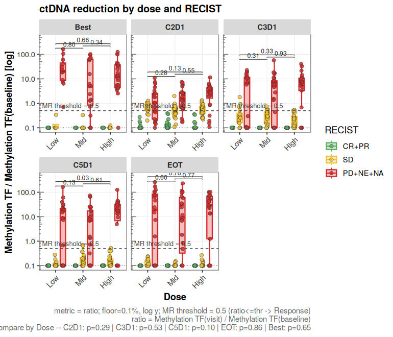

Same base data, `metric = "tf"` with log y-axis:

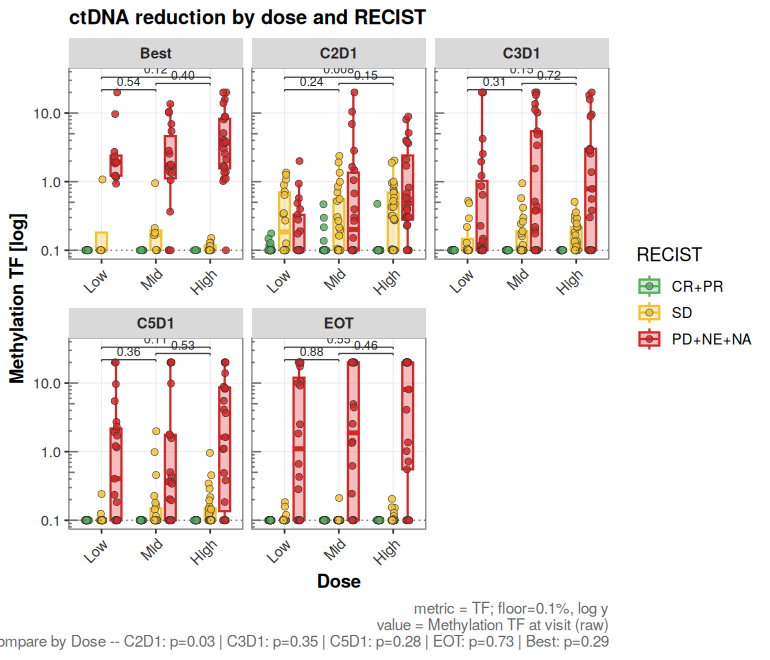

### 3b. `measure` — which ctDNA quantity

```r
ctdna_plot_reduction(prep, measure = "maxvaf",  scheme = "three")
ctdna_plot_reduction(prep, measure = "meanvaf", scheme = "three")
ctdna_plot_reduction(prep, measure = "all",     scheme = "three")
```

### 3c. `at` — which on-treatment visit(s)

- `"all"` (default) — every on-treatment visit becomes a facet
- `"best"` — deepest drop per subject
- a single visit label — e.g. `"C2D1"`
- a vector of labels — e.g. `c("C2D1", "C3D1")`

```r
ctdna_plot_reduction(prep, at = "best",  scheme = "three")
ctdna_plot_reduction(prep, at = "C2D1",  scheme = "three")
ctdna_plot_reduction(prep, at = c("C2D1", "C3D1"), scheme = "three")
```

Best per-subject only:

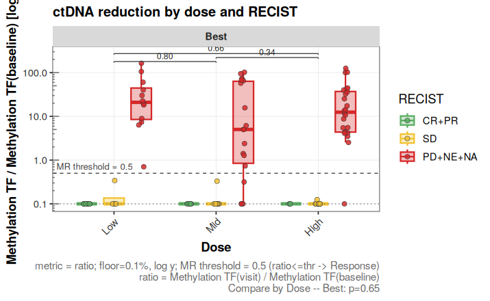

Chosen visits:

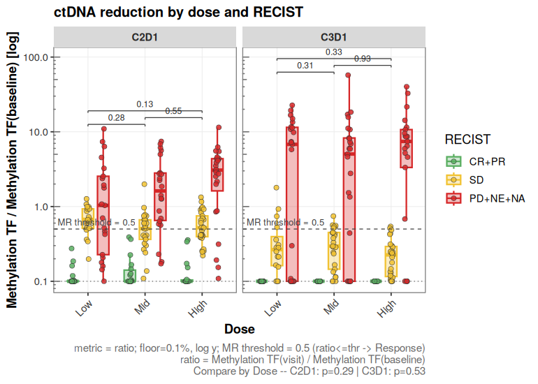

### 3d. `group_by` / `subgroup_by` orientation

```r
ctdna_plot_reduction(prep, group_by = "Dose",   subgroup_by = "RECIST", scheme = "three")
ctdna_plot_reduction(prep, group_by = "RECIST", subgroup_by = "Dose",   scheme = "three")
```

### 3e. `compare_by`, `pairwise`, `p_adjust`

```r
ctdna_plot_reduction(prep, metric = "tf",
                     group_by = "Dose", subgroup_by = "RECIST",
                     compare_by = "group_within_subgroup",
                     p_adjust = "bh", scheme = "three",
                     y_scale = "log10")
```

### 3f. `scheme`, `y_scale`, `ylim`, `indication`

```r
ctdna_plot_reduction(prep, at = "best", scheme = "two")
ctdna_plot_reduction(prep, at = "best", scheme = "four")
ctdna_plot_reduction(prep, metric = "tf", y_scale = "log10", scheme = "three")
ctdna_plot_reduction(prep, scheme = "three", indication = c("Tumor_A","Tumor_D"))
```

---

## 4. `ctdna_plot_longitudinal()` and `longitudinal_stats()`

Rows with `NA` in any `group_by` / `facet` column are dropped
(matching baseline and reduction), so there is no `Dose = NA`
panel.

### 4a. `group_by`, `facet`

```r
ctdna_plot_longitudinal(prep, group_by = NULL,     facet = "Dose")
ctdna_plot_longitudinal(prep, group_by = "RECIST", facet = "Dose")
ctdna_plot_longitudinal(prep, group_by = "Dose",   facet = NULL)
ctdna_plot_longitudinal(prep, facet = c("Dose", "RECIST"))
ctdna_plot_longitudinal(prep, group_by = "RECIST", facet = "Indication")
```

Trajectory coloured by RECIST, faceted by Dose:

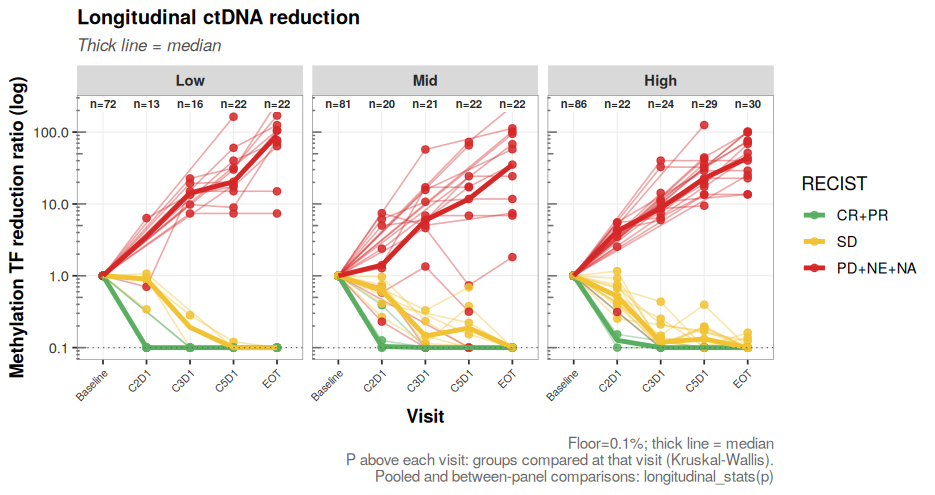

Two-variable facet grid:

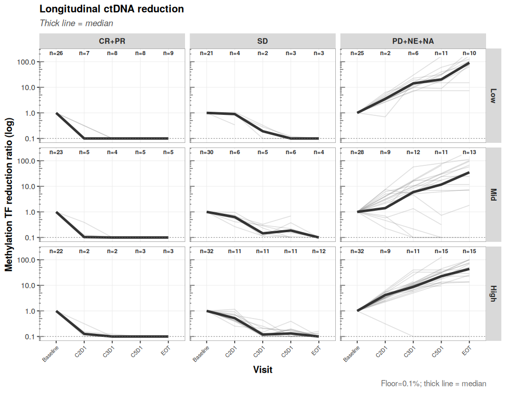

Faceted by indication (all five cohorts, per-visit n):


### 4b. `measure = "all"`

```r
ctdna_plot_longitudinal(prep, group_by = "RECIST", facet = "Dose",
                        measure = "all")
```

### 4c. `p_adjust`, `ylim`, `indication`

```r
ctdna_plot_longitudinal(prep, group_by = "RECIST", facet = "Dose",
                        p_adjust = "bh")
ctdna_plot_longitudinal(prep, group_by = "RECIST", facet = "Dose",
                        ylim = c(0.1, 100))
ctdna_plot_longitudinal(prep, group_by = "RECIST",
                        indication = c("Tumor_A","Tumor_B"))
```

### 4d. Retrieving comparison tables with `longitudinal_stats()`

```r
p_long <- ctdna_plot_longitudinal(prep, group_by = "RECIST",
                                   facet = "Dose")
s <- longitudinal_stats(p_long)

s$within_panel     # overall + pairwise group comparison per panel
s$between_panels   # whole-trajectory LMM comparison between panels
```

---

## 5. `ctdna_concordance()` — categorical / ordinal concordance

Categorical/ordinal concordance function that replaces the older
`mr_recist`. Defaults reproduce the old MR-vs-RECIST tile; either
axis can be any categorical column.

- When the two axes share a category set, reports
  **agreement + Cohen's kappa** (weighted kappa if
  `ordinal = TRUE`, McNemar for 2×2).
- When they differ (e.g. MR vs RECIST), reports the
  **chi-square test of association + Cramér's V**.
- Continuous axes error out.

```r
ctdna_concordance(prep)                                # MR vs RECIST (scheme three)
ctdna_concordance(prep, scheme = "two")                # binary RECIST -> 2x2
ctdna_concordance(prep, mr_threshold = 0.3)            # stricter MR responder cutoff
ctdna_concordance(prep, x = "Dose", y = "RECIST")      # any two categoricals
ctdna_concordance(prep, x = "Indication", y = "RECIST")
ctdna_concordance(prep, scheme = "two", stat = "mcnemar")
ctdna_concordance(prep, indication = c("Tumor_A","Tumor_D"))
```

MR vs RECIST at scheme "three":

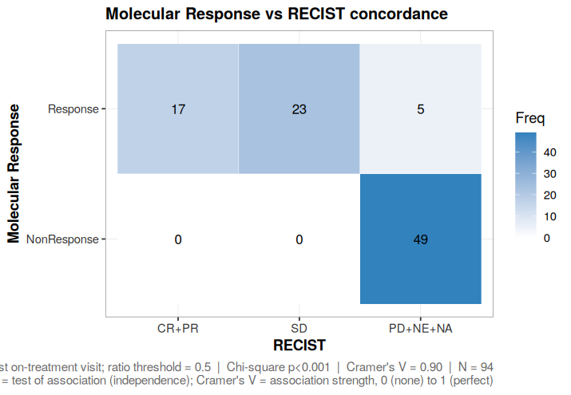

RECIST collapsed to 2×2 (responder vs non):

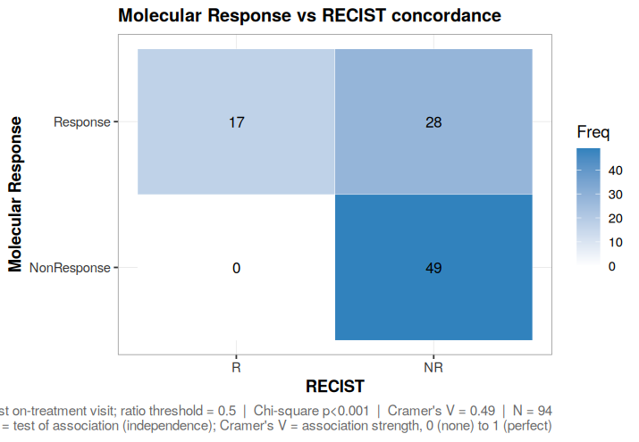

Dose vs RECIST (chi-square + Cramér's V):

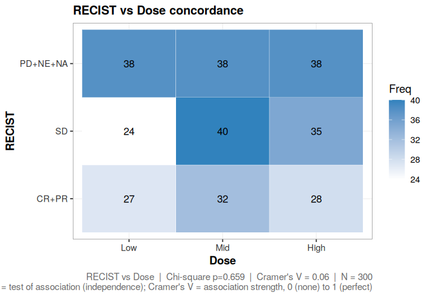

**Panelling (new in 0.79.0).** `facet` — or its alias `wrap` —
tabulates one contingency table per level:

```r
ctdna_concordance(prep, facet = "Indication")
ctdna_concordance(prep, wrap  = "Indication")   # identical
ctdna_concordance(prep, facet = "Indication",
                  indication = c("Tumor_A","Tumor_D"))
```

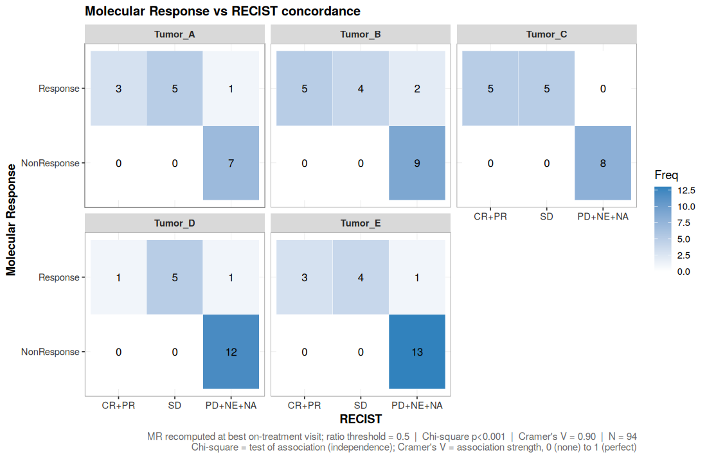

The caption statistics stay **pooled** across the whole cohort —
they describe the same population the un-panelled plot reported.
Per-panel statistics are available from the underlying tables via
`concordance_stats()` on a per-indication call.

**Weighted kappa note.** Weighted kappa applies when both axes
are **ordinal and share the same category set** (e.g.
investigator vs central RECIST, or two RECIST schemes). Pass
`ordinal = TRUE` with two such columns.

```r
concordance_stats(ctdna_concordance(prep, scheme = "two"))[
  c("agreement", "kappa", "chisq_p", "cramers_v", "n")]
```

---

## 6. The comparison trio — scatter and boxplot

Together with `ctdna_concordance()`, `ctdna_plot_scatter()` and
`ctdna_boxplot()` form the **comparison trio**:

| function | left type | right type |
|---|---|---|
| `ctdna_plot_scatter()` | continuous | continuous |
| `ctdna_concordance()` | categorical | categorical |
| `ctdna_boxplot()` | categorical | continuous |

### 6a. `ctdna_plot_scatter()` — continuous × continuous

```r
ctdna_plot_scatter(prep)                    # maxVAF vs methylTF, log-log
ctdna_plot_scatter(prep, color_by = "RECIST", shape_by = "Dose")
ctdna_plot_scatter(prep, regression = TRUE, ci_band = TRUE)
ctdna_plot_scatter(prep, x = "reduction", y = "tumor_change",
                   y_scale = "linear", hline = -30,
                   color_by = "Dose", shape_by = "RECIST")
ctdna_plot_scatter(prep, x = "meanvaf", y = "methyl", stat = "pearson")
ctdna_plot_scatter(prep, color_by = "Indication")
ctdna_plot_scatter(prep, indication = c("Tumor_A","Tumor_D"))
```

Default (max VAF vs methylation TF, log-log):

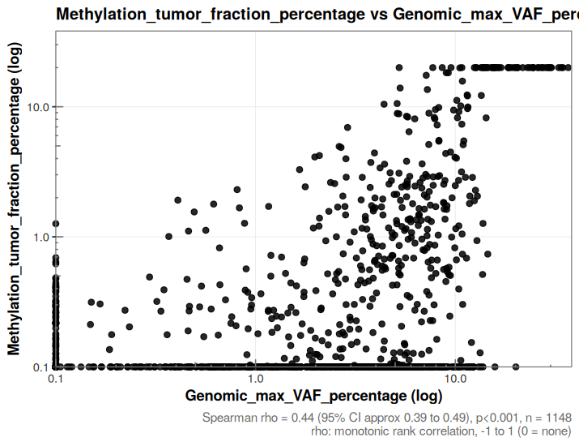

Coloured by RECIST, shape by Dose:

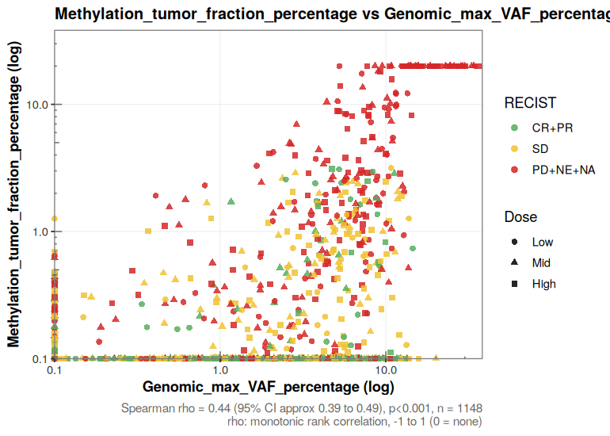

With regression + CI band:

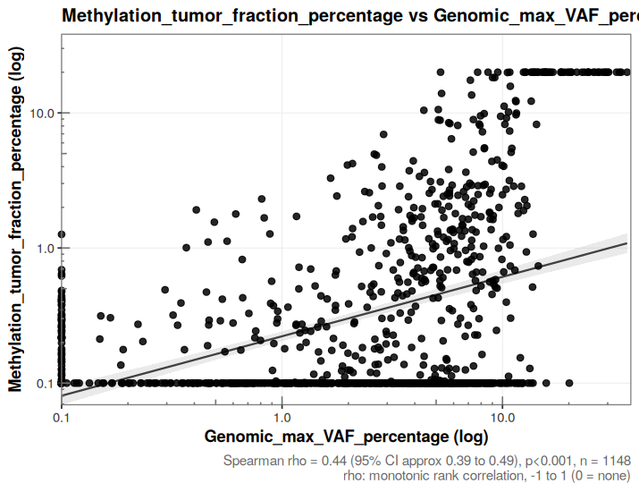

```r
scatter_stats(ctdna_plot_scatter(prep))     # all three correlations + CIs
```

### 6b. `ctdna_boxplot()` — continuous y by categorical x

`y` accepts the same tokens as scatter, plus `ctdna_change`
(= `(ratio − 1) × 100`) and `tumor_size_change` /
`best_tumor_size_change`. `x` / `color_by` / `facet` accept any
ctDNA or clinical column, including `"Indication"`.

```r
ctdna_boxplot(prep, y = "methyl", x = "RECIST",
              y_scale = "log10", p_adjust = TRUE, point_alpha = 0.3)
ctdna_boxplot(prep, y = "TMB_score", x = "Dose")
ctdna_boxplot(prep, y = "ctdna_change", x = "RECIST", visit = "C2D1")
ctdna_boxplot(prep, y = "best_tumor_size_change", x = "RECIST",
              facet = "Indication")
ctdna_boxplot(prep, y = "methyl", x = "Dose", color_by = "RECIST",
              compare_by = "subgroup_within_group",
              y_scale = "log10", point_alpha = 0.2)
ctdna_boxplot(prep, y = "reduction", x = "mutation:TP53", y_scale = "log10")
ctdna_boxplot(prep, y = "methyl", x = "Indication", y_scale = "log10")
```

Methylation TF by RECIST:

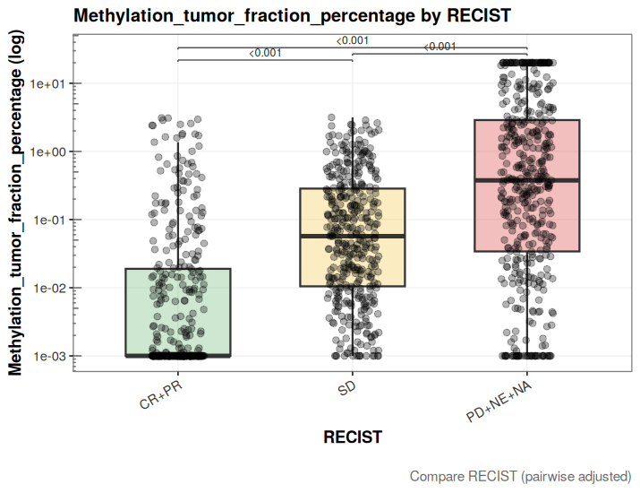

TMB by dose (arbitrary numeric column):

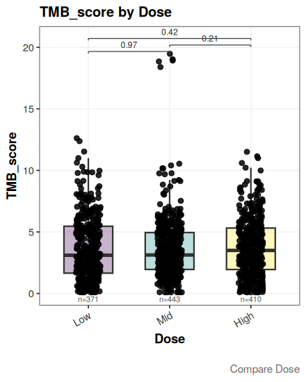

Methylation TF by indication:


### 6c. Cheat sheet — analysis skeletons

```r
# core ctDNA reduction views
ctdna_plot_baseline    (prep, measure  = "methyl")
ctdna_plot_reduction   (prep, group_by = "Dose", subgroup_by = "RECIST")
ctdna_plot_longitudinal(prep, group_by = "RECIST", facet = "Dose")

# per-cohort views
ctdna_plot_baseline    (prep, group_by = "Indication")
ctdna_plot_longitudinal(prep, group_by = "RECIST", facet = "Indication")
ctdna_plot_reduction   (prep, indication = c("Tumor_A","Tumor_D"))

# tumour size (from prep$assessments)
ctdna_boxplot     (prep, y = "tumor_size_change", x = "Tumor_visit_name")
ctdna_boxplot     (prep, y = "best_tumor_size_change", x = "RECIST")
ctdna_plot_scatter(prep, x = "reduction", y = "tumor_change")

# comparison trio
ctdna_concordance (prep, x = "RECIST",   y = "MR")                    # cat x cat
ctdna_plot_scatter(prep, x = "maxvaf",   y = "methyl")                # cont x cont
ctdna_boxplot     (prep, y = "methyl",   x = "Dose",
                   color_by = "RECIST", compare_by = "subgroup")      # cont x cat

# mutation-status conditioning
ctdna_boxplot     (prep, y = "reduction", x = "mutation:TP53",
                   y_scale = "log10")
ctdna_concordance (prep, x = "RECIST",    y = "mutation:TP53")
```

---

## 7. Genomic landscape

Gene-set definitions used below. On the mock, alterations
populate the panel oncogenes; a real study should substitute its
own biologically-motivated sets (HRR, TSG tiers, indication
drivers, and so on).

```r
RTK            <- c("EGFR","ERBB2","MET","ALK","RET","ROS1",
                    "FGFR1","FGFR3","KIT")
RAS_MAPK       <- c("KRAS","NRAS","BRAF","PIK3CA")
Cell_cycle_TSG <- c("TP53","PTEN","CDKN2A","CDK4","CCND1","RB1")
```

### 7a. Oncoprint

Patient × gene tile plot with response annotation on top,
alteration classes coloured, per-gene alteration-frequency bars
on the right. Uses the **ComplexHeatmap engine** whenever
`ComplexHeatmap` is installed (recommended), and falls back to a
simpler ggplot layout otherwise.

```r
op <- ctdna_oncoprint(prep,
        gene_sets         = list(RTK            = RTK,
                                 RAS_MAPK       = RAS_MAPK,
                                 Cell_cycle_TSG = Cell_cycle_TSG),
        filter_scheme     = "scheme_basic",
        visit             = "baseline",
        top_annotations   = "RECIST",
        annotation_labels = c(RECIST = "Response"),
        group_patients_by = "RECIST",
        scheme            = "two",
        title             = "ctDNA alteration landscape")
op            # S3 print method dispatches to ComplexHeatmap::draw()
```

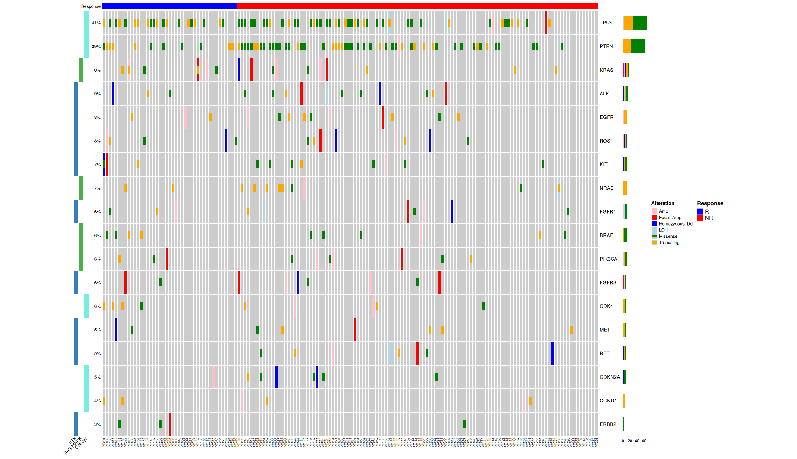

Rows are split by gene set (left-side coloured strip), columns
are split by RECIST group (top bar labels R vs NR), grey cells
are patients with no alteration in that gene. Per-gene frequency
bars on the right show the % altered and the
stacked-by-alteration-class breakdown.

Add `wrap = "Indication"` to panel by cohort, or
`indication = "Tumor_D"` to restrict to one — see
[Loop vs. vector](#loop-vs-vector) for per-cohort figures.

**Building a prevalence table from the same base:**

```r
op_base   <- ctdnaTM:::.build_landscape_base(
  prep, filter_scheme = "scheme_basic",
  visit = "baseline", visit_col = "Visit_name",
  patient_col = "Patient_ID", gene_col = "Gene",
  fn_label = "ctdna_oncoprint")

op_v      <- op_base$variants
op_pd     <- op_base$patient_data
all_genes <- unique(c(RTK, RAS_MAPK, Cell_cycle_TSG))

op_prev <- do.call(rbind, lapply(sort(unique(op_pd$Indication)), function(ind) {
  pids <- op_pd$Patient_ID[op_pd$Indication == ind]
  do.call(rbind, lapply(all_genes, function(g) {
    n_alt <- length(unique(op_v$Patient_ID[
      op_v$Patient_ID %in% pids & op_v$Gene == g]))
    data.frame(Indication = ind, Gene = g,
               altered = n_alt, total = length(pids),
               pct = round(100 * n_alt / max(length(pids), 1), 1),
               stringsAsFactors = FALSE)
  }))
}))

# render with DT::datatable if you want an interactive HTML table
```

### 7b. Alteration grid

Combinatorial alteration status per gene-set expression, split by
response, with per-cell Fisher / chi-square tests.

The gene-set list accepts **alteration DSL** helpers:

- `alt_any(genes)` — altered in **any** of the listed genes
- `alt_all(genes)` — altered in **all** of the listed genes
- `alt_any_n(genes, n)` — altered in at least `n` of them

```r
gr <- ctdna_alteration_grid(prep,
        filter_scheme = "scheme_basic",
        visit         = "baseline",
        wrap          = "Indication",
        gene_sets = list(
          TP53           = "TP53",
          PTEN           = "PTEN",
          CDKN2A         = "CDKN2A",
          RTK            = alt_any(RTK),
          RAS_MAPK       = alt_any(RAS_MAPK),
          Cell_cycle_TSG = alt_any(Cell_cycle_TSG)),
        response_col  = "RECIST",
        scheme        = "two",
        stat          = "fisher")

gr$plot         # ggplot
gr$summary      # per-cell counts + percentages
gr$stats        # Fisher p per (wrap × gene_set)
```

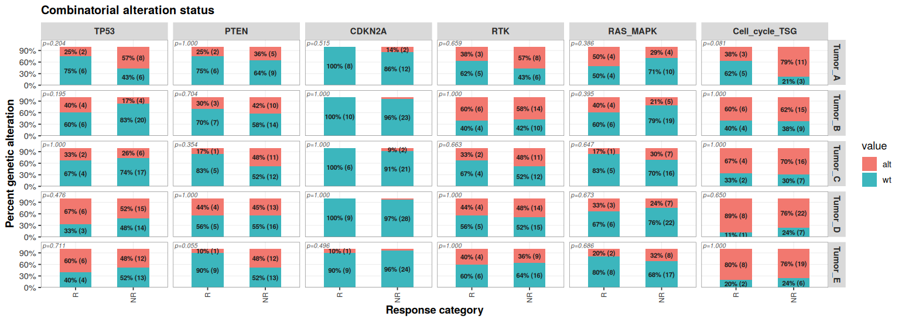

```r
gr_prev       <- gr$summary[gr$summary$value == "alt", ]
gr_prev$pct   <- round(100 * gr_prev$pct, 1)
gr_prev$value <- NULL
head(gr_prev)
```

### 7c. Pipeline — one call, every deliverable

`ctdna_pipeline()` orchestrates every deliverable in a single
call. Top-level arguments (`scheme`, `visit`, `wrap`,
`gene_sets`, `filter_scheme`, `stat`, `engine`, `indication`)
flow to every step that accepts them; `overrides` lets you tweak
individual steps.

```r
res <- ctdna_pipeline(prep,
         filter_scheme = "scheme_basic",
         visit         = "baseline",
         wrap          = "Indication",
         scheme        = "four",
         gene_sets     = list(
           RTK            = alt_any(RTK),
           RAS_MAPK       = alt_any(RAS_MAPK),
           Cell_cycle_TSG = alt_any(Cell_cycle_TSG)),
         stat = "fisher")

res$oncoprint$plot
res$alteration_grid$plot
res$alteration_grid$summary   # per-cell counts, pct
res$alteration_grid$stats     # Fisher p per (wrap x gene_set)

# restrict the whole pipeline to selected cohorts
res_sub <- ctdna_pipeline(prep, indication = c("Tumor_A","Tumor_D"))

# override just one step
res2 <- ctdna_pipeline(prep,
          which     = "alteration_grid",
          wrap      = "Indication",
          overrides = list(alteration_grid = list(wrap = "Dose")))

res                # prints a summary
res$skipped        # named list: key -> reason
```

### 7d. Filter-scheme catalog and visualisation

```r
ctdna_filter_schemes_list()                             # all schemes
ctdna_filter_schemes_list(category = "gene_set_only")   # scope-restricted only

print(visualized_scheme("scheme_basic", width = 120))
print(visualized_scheme("TSG_Tier1",    width = 120))
print(visualized_scheme("TSG_Tier2",    width = 120))
print(visualized_scheme("TSG_Tier3",    width = 120))
print(visualized_scheme("HRR14",        width = 120))
```

### 7e. Tissue DNA-seq and concordance oncoprint

`dnaseq_create()` walks a DNA-seq vendor delivery folder,
normalises variant / CNV / consequence strings through the
`dnaseq` dictionary, and returns a canonical alteration frame:

```r
dnaseq_df <- dnaseq_create(
  loc       = "/path/to/DNASeq/",
  regex_snv = "*_somatic_dna_small_variant_lowpopulationfreq_report_preferred.tsv",
  regex_cnv = "*_somatic_dna_gene_cna_report_*.tsv",
  verbose   = TRUE)

# canonicalise Patient_ID to match the ctDNA / ADaM SUBJID convention
dnaseq_df$Patient_ID <- sub("^DNA_Tumor_", "", dnaseq_df$Patient_ID)

prep <- ctdna_prep_add(prep, dnaseq = dnaseq_df)
```

Once tissue is attached, run the paired ctDNA / tissue
concordance oncoprint for a chosen cohort:

```r
res <- ctdna_concordance_oncoprint_core(prep,
         tissue_df = prep$dnaseq,
         gene_sets = list(
           RTK            = alt_any(RTK),
           RAS_MAPK       = alt_any(RAS_MAPK),
           Cell_cycle_TSG = alt_any(Cell_cycle_TSG)),
         filter_scheme     = "scheme_basic",
         visit             = "baseline",
         indication        = "Tumor_D",
         top_annotations   = c("RECIST", "Dose"),
         annotation_labels = c(RECIST = "Response"),
         group_patients_by = "RECIST",
         scheme            = "three",
         sort_by           = "overlap",
         sort_genes        = "overlap",
         title             = "ctDNA vs Tissue concordance -- Tumor_D")
print(res)
```

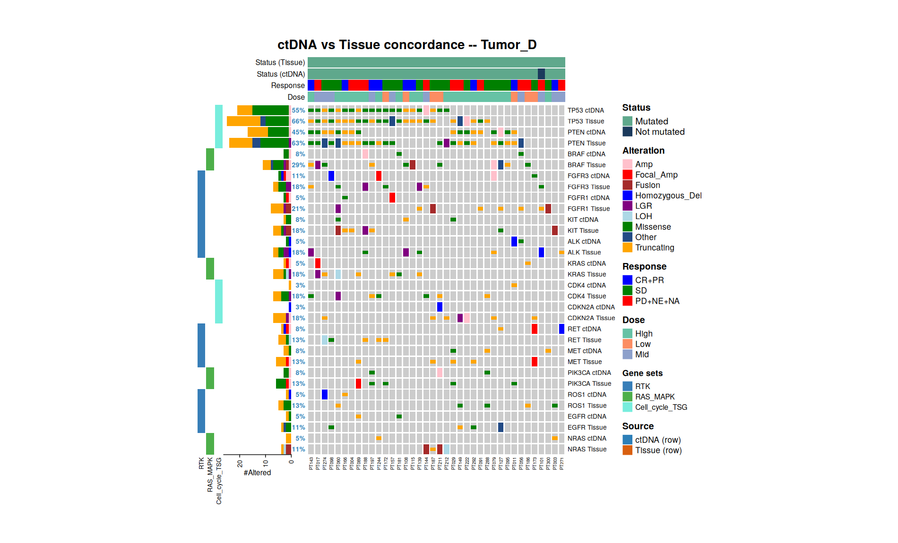

Each gene contributes **two adjacent rows** — one labelled
`GENE·ctDNA`, one `GENE·Tissue` — and each patient is a **single
column**. Coloured cells are alterations by class; grey cells are
wild-type.

Reading it:

* **`Status (Tissue)` / `Status (ctDNA)`** at the top mark, per
  patient, whether any displayed gene is altered in that source.
  The two strips are adjacent so concordance is scannable at a
  glance — both green = concordant positive, both navy =
  concordant negative, mismatched = discordant.
* **Left bars** are the stacked alteration-type counts for that
  row, sharing an `n altered` scale, with the **% of patients
  altered** printed per row. Because ctDNA and Tissue are separate
  rows you can read them off directly (e.g. EGFR 16% in ctDNA vs
  28% in tissue).
* `top_annotations = c("RECIST","Dose")` adds the requested
  per-patient strips below the Status rows;
  `group_patients_by = "RECIST"` splits the columns into response
  blocks; `show_patient_names` controls the column labels.

For one figure per cohort, loop over the cohorts you want — see
[Loop vs. vector](#loop-vs-vector).

---

## Statistical helpers

Eight standalone functions cover the tests every plot uses
internally. All accept plain R vectors / data frames.

```r
# Format p-values for annotations
ctdna_pval_label(c(0.0001, 0.034))          # "p<0.001" "p=0.034"

# Auto-selected group comparison test
set.seed(42)
df <- data.frame(group = rep(c("a","b","c"), each = 12),
                  x    = c(rnorm(12), rnorm(12, 1), rnorm(12, 1.5)))
ctdna_run_group_test(df, "x", "group")

# All pairwise Wilcoxon comparisons
ctdna_pairwise_ranksum(df, "x", "group")

# Correlation with Spearman by default
x <- runif(30); y <- 2 * x + rnorm(30, sd = 0.3)
ctdna_cor_test(x, y)
ctdna_cor_test(x, y, method = "pearson")

# Paired test (baseline vs on-treatment measurements)
a <- runif(20, 5, 15); b <- a * runif(20, 0.2, 0.9)
ctdna_paired_test(a, b)                              # paired Wilcoxon
ctdna_paired_test(a, b, method = "paired_t")

# Cohen's kappa on a 3-level agreement table
tab <- as.table(matrix(c(8,2,0, 1,10,1, 0,1,7), nrow = 3, byrow = TRUE,
                        dimnames = list(rater1 = c("PR","SD","PD"),
                                        rater2 = c("PR","SD","PD"))))
ctdna_cohen_kappa(tab)
ctdna_weighted_kappa(tab, weights = "quadratic")

# Bundled concordance summary (kappa + agreement + McNemar for 2x2)
ctdna_concordance_test(tab)
```

---

## Configuration — `ctdna_opts()`

Session-wide defaults live in `ctdna_opts()` — column-name
mappings, plot geometry, statistical thresholds, RECIST
vocabulary, LoQ, palettes, and more.

```r
ctdna_opts("indication")                   # -> "indication"
ctdna_opts("subject", "tf", "loq")         # get several

ctdna_opts(indication = "MyCohortCol",     # set values
           stat_position = "caption")

ctdna_opts()                                # print full config
ctdna_opts(domain = "clinical")             # print one family

# round-trip
f <- tempfile(fileext = ".rds")
ctdna_opts_save(f)
ctdna_opts(.reset = TRUE)                   # restore defaults
ctdna_opts_load(f)
unlink(f)
```

Custom schemes:

```r
ctdna_create_scheme(
  name     = "my_short_tsg",
  genes    = c("TP53","RB1","PTEN"),
  criteria = c("somatic","truncating","clinvar_path"),
  combine  = "any")
```

`criteria` accepts: `"truncating"`, `"missense"`,
`"clinvar_path"`, `"cnv_del"`, `"cnv_amp"`, `"lgr"`, `"fusion"`,
`"somatic"`, `"germline"`, `"rare"`.

---

## Bug reports

Please file issues at
<https://github.com/nikleotide/ctdnaTM/issues>.
