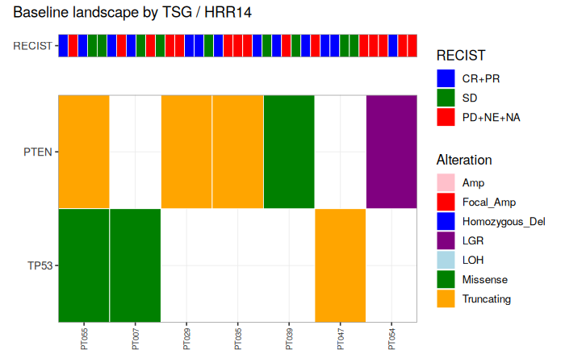
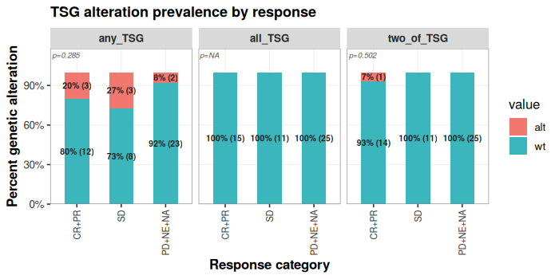

This vignette walks through every user-facing function in `ctdnaTM`, grouped by workflow stage. Every function is invoked at least once; every argument that has a non-default meaning is exercised. The mock study built by `ctdna_make_mock_study()` is used throughout so the whole document runs end-to-end without external data.

# 1. Set up


```r
library(ctdnaTM)
sim  <- ctdna_make_mock_study(n_patients = 60, seed = 3)
```

`ctdna_make_mock_study()` returns a list with the same shape as a real Guardant Health Infinity delivery — `infinity_report` (variants), optional panel frames, and a simple `clinical` ADaM frame.

# 2. Prepare and QC

## 2.1 `ctdna_prepare()`

Assembles a `ctdna_prep` object from an Infinity report plus any ADaM frames. In v0.73+, `ctdna_prepare()` no longer runs sample QC by default — `prep$variants` comes back raw.


```r
prep <- ctdna_prepare(
  infinity_report = sim$infinity_report,
  adam            = list(adsl = sim$clinical),
  verbose         = FALSE)

class(prep)
#> [1] "ctdna_prep"
names(prep)
#> [1] "samples"     "variants"    "clinical"    "assessments" "dictionary"
nrow(prep$variants)  # raw variants (pre-QC)
#> [1] 591
```

## 2.2 `ctdna_sample_qc()`

Runs sample-level QC on `prep$samples`, drops failing samples, and cascades to `prep$variants` (variants of dropped samples are removed). Idempotent — calling it a second time drops nothing new.


```r
prep <- ctdna_sample_qc(prep, verbose = FALSE)
nrow(prep$variants)  # after QC
#> [1] 541
prep <- ctdna_sample_qc(prep, verbose = FALSE)
nrow(prep$variants)  # unchanged on rerun
#> [1] 541
```

# 3. Variant filtering

## 3.1 Grammar overview

Every filter scheme is built from four combinators plus a library of predicates:

- `rule(Column = value)` — atomic predicate. `value` can be a scalar, vector, or `list(op = "!=", value = ...)` for operators (`==`, `!=`, `<`, `<=`, `>`, `>=`, `%in%`, and `==col` for column-to-column comparisons).
- `allOf(a, b, ...)` — AND.
- `anyOf(a, b, ...)` — OR.
- `not(x)` — NOT.

Predicate helpers such as `rule_somatic()`, `rule_truncating()`, `rule_clinvar_path()` are shortcuts for common atomic rules.


```r
# Atomic + AND + OR + NOT
r <- allOf(
  rule(Gene = c("TP53","KRAS")),
  not(rule_synonymous()),
  anyOf(rule_somatic(), rule_germline()))
class(r)
#> [1] "ctdna_rule_combinator" "ctdna_rule"
```

## 3.2 Built-in schemes

`ctdnaTM` ships four biomarker schemes plus a permissive fallback, keyed by name:

- `TSG_Tier1()` — most permissive TSG (TP53/RB1/PTEN). Any impactful somatic short variant, fusion, or deleterious LGR.
- `TSG_Tier2()` — intermediate TSG (TP53/RB1/PTEN). Somatic LoF, ClinVar-P/LP missense/inframe, LOH or homozygous deletion, or somatic deleterious intra-chromosomal LGR.
- `TSG_Tier3()` — most restrictive TSG (TP53/RB1/PTEN). Germline P/LP, somatic LoF, somatic ClinVar-P/LP + missense/inframe, LOH or homozygous deletion. No LGR, no fusion, no rare-P/LP-synonymous carve-in.
- `HRR14()` — HRR biomarker on 14 HRR genes. ClinVar P/LP, truncating + rare + not-BRCA2-K3326X, homozygous deletion, or somatic deleterious intra-genic LGR.
- `scheme_basic()` — GH Infinity "impactful alterations" ruleset applied to all genes.

All four biomarker schemes drop ClinVar benign and CHIP unconditionally. Each scheme's body is broken into **named branches** so the `filtering_criteria` column tells you which branch fired (e.g. `PASS::TSG_Tier1(somatic_nonsyn)` rather than just `PASS::TSG_Tier1`).


```r
visualized_scheme(TSG_Tier1(), width = 76)
#> TSG_Tier1  (category: gene_set)
#> TSG Tier 1 (most permissive) on TP53/RB1/PTEN. Drops ClinVar benign and
#> CHIP. Passes: germline P/LP, OR somatic non-synonymous, OR somatic
#> LOH/homozygous deletion, OR somatic deleterious LGR (any subtype), OR
#> somatic fusion.
#> 
#> REQUIRE (gates -- if any fail -> DROP):
#>   |- Gene in {TP53, RB1, PTEN}
#>   |- NOT (ClinVar in {Benign, Likely_benign, Benign/Likely_benign})
#>   `- NOT (Somatic_status = somatic_putative_ch)
#> 
#> KEEP if ANY of these paths succeeds:
#> 
#>   PATH A -- Somatic_status + ClinVar
#>     |- Somatic_status = germline
#>     `- ClinVar in {Pathogenic, Likely_pathogenic, Pathogenic/Likely_pathogenic, Pathogenic/Likely_pathogenic,_other, Likely_pathogenic,_other, Likely_pathogenic,_risk_factor}
#> 
#>   PATH B -- Somatic_status + Molecular_consequence
#>     |- Somatic_status = somatic
#>     `- (Molecular_consequence in {missense, inframe_indel, inframe_insertion, inframe_deletion, inframe_duplication, nonsense, frameshift, stop_lost, start_lost, splice_acceptor, splice_donor} OR Molecular_consequence = synonymous AND ClinVar in {Pathogenic, Likely_pathogenic, Pathogenic/Likely_pathogenic, Pathogenic/Likely_pathogenic,_other, Likely_pathogenic,_other, Likely_pathogenic,_risk_factor} AND gnomAD_AF < 0.01)
#> 
#>   PATH C -- Somatic_status + CNV_type
#>     |- Somatic_status = somatic
#>     `- CNV_type in {loh_deletion, homozygous_deletion}
#> 
#>   PATH D -- Somatic_status + Variant_type + Functional_impact
#>     |- Somatic_status = somatic
#>     |- Variant_type = LGR
#>     `- Functional_impact = deleterious
#> 
#>   PATH E -- Somatic_status + Variant_type
#>     |- Somatic_status = somatic
#>     `- Variant_type = Fusion
#> 
#> Otherwise -> DROP.
```


```r
visualized_scheme(HRR14(), width = 76)
#> HRR14  (category: gene_set)
#> HRR biomarker on the 14 HRR genes. Drops ClinVar benign and CHIP. Passes:
#> germline or somatic ClinVar P/LP, OR truncating + rare(<1%)
#> not-BRCA2-K3326X, OR somatic deleterious intra-genic LGR (deletion,
#> tandem-duplication, inversion; Gene == Fusion_gene_b), OR homozygous
#> deletion.
#> 
#> REQUIRE (gates -- if any fail -> DROP):
#>   |- Gene in {BRCA1, BRCA2, ATM, BARD1, BRIP1, CDK12, CHEK1, CHEK2, FANCL, PALB2, RAD51B, RAD51C, RAD51D, RAD54L}
#>   |- NOT (ClinVar in {Benign, Likely_benign, Benign/Likely_benign})
#>   `- NOT (Somatic_status = somatic_putative_ch)
#> 
#> KEEP if ANY of these paths succeeds:
#> 
#>   PATH A -- ClinVar
#>     `- ClinVar in {Pathogenic, Likely_pathogenic, Pathogenic/Likely_pathogenic, Pathogenic/Likely_pathogenic,_other, Likely_pathogenic,_other, Likely_pathogenic,_risk_factor}
#> 
#>   PATH B -- Molecular_consequence + gnomAD_AF + not Gene + Mut_aa
#>     |- Molecular_consequence in {frameshift, nonsense, start_lost, stop_lost, splice_acceptor, splice_donor}
#>     |- gnomAD_AF < 0.01
#>     `- NOT (Gene = BRCA2 AND Mut_aa in {p.K3326*, K3326*, p.Lys3326*})
#> 
#>   PATH C -- Somatic_status + Variant_type + Functional_impact + Variant_type + Direction_a + Direction_b + Gene
#>     |- Somatic_status = somatic
#>     |- Variant_type = LGR
#>     |- Functional_impact = deleterious
#>     |- (Variant_type = LGR AND Direction_a = -1 AND Direction_b = 1 OR Variant_type = LGR AND Direction_a = 1 AND Direction_b = -1 OR Variant_type = LGR AND (Direction_a = 1 AND Direction_b = 1 OR Direction_a = -1 AND Direction_b = -1))
#>     `- Gene ==col Fusion_gene_b
#> 
#>   PATH D -- Variant_type + CNV_type
#>     |- Variant_type = CNV
#>     `- CNV_type = homozygous_deletion
#> 
#> Otherwise -> DROP.
```

## 3.3 `ctdna_variant_filter()`

The single entry point for variant filtering. Two mandatory flags decide what happens:

| `apply` | `explain` | effect |
|:-:|:-:|:--|
| `TRUE`  | `TRUE`  | `prep$variants` filtered; annotated snapshot at `prep$filter_explanation$<sig>` |
| `TRUE`  | `FALSE` | `prep$variants` filtered; no snapshot |
| `FALSE` | `TRUE`  | `prep$variants` unchanged; snapshot only |
| `FALSE` | `FALSE` | error (nothing to do) |

Live `prep$variants` never carries the `filtering_criteria` column; that column lives only on the annotated snapshot.


```r
# Apply and explain in one call
prep2 <- ctdna_variant_filter(prep, "TSG_Tier1",
                              apply = TRUE, explain = TRUE, verbose = FALSE)
nrow(prep2$variants)                                             # filtered
#> [1] 34
nrow(prep2$filter_explanation$TSG_Tier1)                         # all rows, annotated
#> [1] 541
table(prep2$filter_explanation$TSG_Tier1$filtering_criteria, useNA = "always")
#> 
#>                     FAIL::TSG_Tier1 PASS::TSG_Tier1(LOH_or_homozyg_del) 
#>                                  18                                   2 
#>    PASS::TSG_Tier1(deleterious_LGR)             PASS::TSG_Tier1(fusion) 
#>                                   4                                   2 
#>       PASS::TSG_Tier1(germline_PLP)     PASS::TSG_Tier1(somatic_nonsyn) 
#>                                   2                                  24 
#>                                <NA> 
#>                                 489
```

Combining schemes — pass a vector of names or a list of schemes. Row passes if any in-scope scheme passes; the criteria column names every in-scope scheme that fired and, for schemes with named branches, which branch fired.


```r
prep3 <- ctdna_variant_filter(prep,
  filter_scheme = c("TSG_Tier1","TSG_Tier2","HRR14"),
  apply = TRUE, explain = TRUE, verbose = FALSE)

names(prep3$filter_explanation)   # snapshot key = "TSG_Tier1_TSG_Tier2_HRR14"
#> [1] "TSG_Tier1_TSG_Tier2_HRR14"
head(sort(table(prep3$filter_explanation[[1]]$filtering_criteria,
                useNA = "ifany"), decreasing = TRUE), 6)
#> 
#>                                                             <NA> 
#>                                                              489 
#>                                       FAIL::TSG_Tier1, TSG_Tier2 
#>                                                               18 
#>          PASS::TSG_Tier1(somatic_nonsyn), TSG_Tier2(somatic_LoF) 
#>                                                               14 
#>                                  PASS::TSG_Tier1(somatic_nonsyn) 
#>                                                                7 
#>                                 PASS::TSG_Tier1(deleterious_LGR) 
#>                                                                4 
#> PASS::TSG_Tier1(somatic_nonsyn), TSG_Tier2(somatic_PLP_missense) 
#>                                                                3
# Typical labels:
#   PASS::TSG_Tier1(somatic_nonsyn), TSG_Tier2(somatic_LoF)
#   PASS::TSG_Tier1(deleterious_LGR)
#   FAIL::TSG_Tier1, TSG_Tier2
#   NA   (row in no scheme's scope)
```

## 3.4 `ctdna_create_scheme()`

Thin builder for user schemes. Covers the flat AND/OR case with positive predicates. For anything more complex (negation, nesting) use `create_filtering_scheme()` with the full grammar.


```r
my <- ctdna_create_scheme(
  name     = "mini_tsg",
  genes    = c("TP53","RB1"),
  criteria = c("somatic","truncating"),
  combine  = "all",
  overwrite = TRUE)

prep4 <- ctdna_variant_filter(prep, "mini_tsg",
                              apply = TRUE, explain = FALSE, verbose = FALSE)
nrow(prep4$variants)
#> [1] 6
```

## 3.5 `create_filtering_scheme()` — the full grammar

For schemes that need negation or nested logic. This is the low-level builder; `ctdna_create_scheme()` and every built-in scheme are wrappers around it.


```r
sch <- create_filtering_scheme(
  rule(Gene = c("TP53","RB1","PTEN")),
  not(rule_clinvar_benign()),
  not(rule_ch()),
  anyOf(
    allOf(rule_germline(), rule_clinvar_path()),
    allOf(rule_somatic(),
          anyOf(rule_truncating(),
                allOf(rule_missense(), rule_rare_001())))),
  name = "custom_tsg",
  description = "TSG: germline P/LP OR somatic LoF OR somatic rare missense.",
  overwrite = TRUE)
class(sch)
#> [1] "ctdna_filtering_scheme" "ctdna_rule"
```

## 3.6 Scheme catalog helpers


```r
head(ctdna_filter_schemes_list(), 10)
#>     name            category indication n_genes variant_type
#> 1  NSCLC indication_gene_set      NSCLC      25         <NA>
#> 2  HNSCC indication_gene_set      HNSCC      21         <NA>
#> 3   SCLC indication_gene_set       SCLC      15         <NA>
#> 4   BRCA indication_gene_set       BRCA      20         <NA>
#> 5    CRC indication_gene_set        CRC      21         <NA>
#> 6  mCRPC indication_gene_set      mCRPC      16         <NA>
#> 7    GBM indication_gene_set        GBM      19         <NA>
#> 8    HRR       gene_set_only       <NA>      28         <NA>
#> 9   TSGs       gene_set_only       <NA>      25         <NA>
#> 10   RTK       gene_set_only       <NA>      27         <NA>
#>                                                             description
#> 1               Non-small cell lung cancer (NSCLC) - recurrent drivers.
#> 2            Head and neck squamous cell carcinoma - recurrent drivers.
#> 3                           Small cell lung cancer - recurrent drivers.
#> 4                                    Breast cancer - recurrent drivers.
#> 5                                Colorectal cancer - recurrent drivers.
#> 6  Metastatic castration-resistant prostate cancer - recurrent drivers.
#> 7                                     Glioblastoma - recurrent drivers.
#> 8                  Homologous recombination repair (HRR) pathway genes.
#> 9                                 Common tumor suppressor genes (TSGs).
#> 10                      Receptor tyrosine kinases (RTK) / MAPK pathway.
ctdna_filter_scheme_show("HRR14", print = FALSE)$name
#> Error in ctdna_filter_scheme_show("HRR14", print = FALSE): unused argument (print = FALSE)
```

Persistence — save a scheme to disk and reload it in a later session:


```r
ctdna_filter_scheme_save(sch, file = "custom_tsg.rds")
sch2 <- ctdna_filter_scheme_load("custom_tsg.rds")
```

# 4. Genomic landscape plots

## 4.1 `ctdna_oncoprint()`

Takes a `prep`, a named list of gene sets, and returns an oncoprint (ComplexHeatmap engine if installed, ggplot fallback otherwise). Baseline visit by default.


```r
# Add an Indication column so wrap works
prep$adrs <- data.frame(
  Patient_ID = prep$clinical$Patient_ID,
  indication = rep(c("NSCLC","HNSCC","SCLC","mCRPC"),
                   length.out = nrow(prep$clinical)))

op <- ctdna_oncoprint(prep,
        gene_sets     = list(TSG   = c("TP53","RB1","PTEN"),
                             HRR14 = ctdna_gene_set("HRR14")),
        filter_scheme = "TSG_Tier1",
        engine        = "ggplot",
        title         = "Baseline landscape by TSG / HRR14")
op$plot
```



## 4.2 `ctdna_alteration_grid()`

Alteration prevalence grid. Rows are gene sets, columns are the RECIST-derived response strata.

Gene-set entries can be bare vectors (default: any-of) or wrapped with `alt_any()`, `alt_all()`, or `alt_any_n(n)` to change how multi-gene sets combine.


```r
gr <- ctdna_alteration_grid(prep,
        gene_sets = list(
          any_TSG    = c("TP53","RB1","PTEN"),
          all_TSG    = alt_all(c("TP53","RB1","PTEN")),
          two_of_TSG = alt_any_n(c("TP53","RB1","PTEN"), n = 2)),
        scheme    = "three",
        title     = "TSG alteration prevalence by response")
gr$plot
```



# 5. Pipeline

`ctdna_pipeline()` runs every deliverable step whose input modalities are present. Result access is uniform: `res$<key>$plot`. A dry run reports what would execute.


```r
dry <- ctdna_pipeline(prep, dry_run = TRUE, verbose = FALSE)
str(dry$skipped, max.level = 1)
#> List of 2
#>  $ vs_ihc       : chr "needs prep$ihc (not found in prep)."
#>  $ vs_expression: chr "needs prep$rnaseq (not found in prep)."
```


```r
res <- ctdna_pipeline(prep,
         which     = c("oncoprint","alteration_grid"),
         scheme    = "three",
         gene_sets = list(TSG   = c("TP53","RB1","PTEN"),
                          HRR14 = ctdna_gene_set("HRR14")),
         engine    = "ggplot",
         verbose   = FALSE)
names(res)
#> [1] "plots"           "failures"        "skipped"         "timing"         
#> [5] "oncoprint"       "alteration_grid"
```

# 6. Reference: rule predicates

The rule library exports around 60 predicate helpers. The most common ones:

- Somatic status: `rule_somatic()`, `rule_germline()`, `rule_ch()`
- ClinVar: `rule_clinvar_path()`, `rule_clinvar_benign()`, `rule_clinvar_vus()`
- Molecular consequence: `rule_truncating()`, `rule_missense()`, `rule_synonymous()`, `rule_nonsense()`, `rule_frameshift()`, `rule_inframe_indel()`, `rule_splice_acceptor()`, `rule_splice_donor()`
- Variant type: `rule_is_SNV()`, `rule_is_Indel()`, `rule_is_CNV()`, `rule_is_Fusion()`, `rule_is_LGR()`
- CNV subtypes: `rule_cnv_homozyg_del()`, `rule_cnv_loh_del()`, `rule_cnv_focal_amp()`, `rule_cnv_aneuploid_amp()`
- LGR subtypes: `rule_lgr_deletion()`, `rule_lgr_tandem_duplication()`, `rule_lgr_inversion()`, `rule_is_LGR_deleterious()`
- Population frequency: `rule_rare_001()`, `rule_rare_0001()`, `rule_common_001()`
- Gene sets: `rule_genes_HRR14()`, `rule_genes_TSG()`, `rule_genes_RTK()`, `rule_genes_MMR()`
- Indication: `rule_ind_NSCLC()`, `rule_ind_BRCA()`, `rule_ind_SCLC()`, `rule_ind_HNSCC()`, `rule_ind_CRC()`, `rule_ind_mCRPC()`, `rule_ind_GBM()`

See `?ctdna_rules_library` for the complete list.

# 7. Package configuration


```r
ctdna_opts("subject")           # column name for patient ID
#> [1] "Patient_ID"
ctdna_opts("gene")              # column name for gene symbol
#> [1] "Gene"
```

Options are set with `ctdna_opts(key = value, ...)` and can be persisted with `ctdna_opts_save()` / `ctdna_opts_load()`.

# Session info


```r
sessionInfo()
#> R version 4.3.3 (2024-02-29)
#> Platform: x86_64-pc-linux-gnu (64-bit)
#> Running under: Ubuntu 24.04.4 LTS
#> 
#> Matrix products: default
#> BLAS:   /usr/lib/x86_64-linux-gnu/blas/libblas.so.3.12.0 
#> LAPACK: /usr/lib/x86_64-linux-gnu/lapack/liblapack.so.3.12.0
#> 
#> locale:
#> [1] C
#> 
#> time zone: Etc/UTC
#> tzcode source: system (glibc)
#> 
#> attached base packages:
#> [1] stats     graphics  grDevices utils     datasets  methods   base     
#> 
#> other attached packages:
#> [1] knitr_1.45     ctdnaTM_0.77.0
#> 
#> loaded via a namespace (and not attached):
#>  [1] vctrs_0.6.5       patchwork_1.2.0   cli_3.6.2         rlang_1.1.3      
#>  [5] xfun_0.41         highr_0.10        generics_0.1.3    labeling_0.4.3   
#>  [9] glue_1.7.0        colorspace_2.1-0  scales_1.3.0      fansi_1.0.5      
#> [13] grid_4.3.3        munsell_0.5.0     evaluate_0.23     tibble_3.2.1     
#> [17] lifecycle_1.0.4   compiler_4.3.3    dplyr_1.1.4       pkgconfig_2.0.3  
#> [21] farver_2.1.1      R6_2.5.1          tidyselect_1.2.0  utf8_1.2.4       
#> [25] pillar_1.9.0      magrittr_2.0.3    tools_4.3.3       withr_2.5.0      
#> [29] gtable_0.3.4      ggnewscale_0.4.10 ggplot2_3.4.4
```
