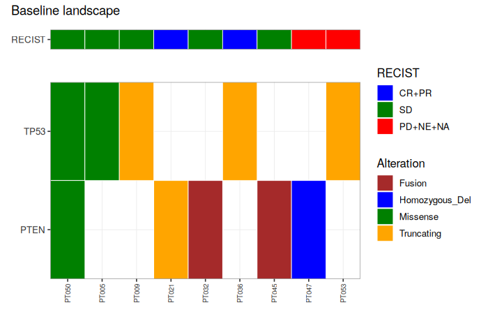
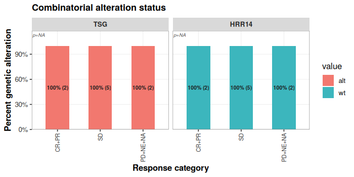

One-page pass through `ctdnaTM`: prepare → QC → filter → plots → pipeline. For a deeper tour of every function see `vignette("ctdnaTM_function_tour")`. For the filter system's internals see `vignette("ctdnaTM_filter_internals")`.

# 1. Assemble the prep object

`ctdnaTM` builds every deliverable off a single **prep** object — a named list holding `$clinical`, `$samples`, `$variants`, and optionally `$assessments`, `$adrs`, and platform-specific frames. `ctdna_prepare()` assembles it from a Guardant Health Infinity report plus any ADaM frames.


```r
library(ctdnaTM)

# Real usage: replace with your infinity_report + ADaM frames.
sim  <- ctdna_make_mock_study(n_patients = 60, seed = 1)
prep <- ctdna_prepare(
  infinity_report = sim$infinity_report,
  adam            = list(adsl = sim$clinical),
  verbose         = FALSE)

class(prep)
#> [1] "ctdna_prep"
setdiff(names(prep), "dictionary")
#> [1] "samples"     "variants"    "clinical"    "assessments"
```

In v0.71+, `ctdna_prepare()` no longer applies sample QC by default — `prep$variants` comes back raw. This is deliberate: two users looking at the same prep will see the same rows.

# 2. Sample QC (idempotent)


```r
prep <- ctdna_sample_qc(prep, verbose = FALSE)
nrow(prep$variants)               # after QC
#> [1] 515
prep <- ctdna_sample_qc(prep, verbose = FALSE)
nrow(prep$variants)               # unchanged on rerun
#> [1] 515
```

# 3. Variant filtering

Single entry point with two mandatory flags:

| `apply` | `explain` | effect |
|:-:|:-:|:--|
| `TRUE`  | `TRUE`  | `prep$variants` filtered; annotated snapshot at `prep$filter_explanation$<sig>` |
| `TRUE`  | `FALSE` | `prep$variants` filtered; no snapshot |
| `FALSE` | `TRUE`  | `prep$variants` unchanged; snapshot only |
| `FALSE` | `FALSE` | error |

Live `prep$variants` never carries the `filtering_criteria` column — it lives only on the snapshot.


```r
prep <- ctdna_variant_filter(prep,
          filter_scheme = c("TSG_Tier1","TSG_Tier2","HRR14"),
          apply         = TRUE,
          explain       = TRUE,
          verbose       = FALSE)

# Row counts in the annotated snapshot
sig <- names(prep$filter_explanation)[1]
sig
#> [1] "TSG_Tier1_TSG_Tier2_HRR14"
head(sort(table(prep$filter_explanation[[sig]]$filtering_criteria,
                useNA = "ifany"), decreasing = TRUE), 6)
#> 
#>                                                             <NA> 
#>                                                              470 
#>                                       FAIL::TSG_Tier1, TSG_Tier2 
#>                                                               14 
#>                                  PASS::TSG_Tier1(somatic_nonsyn) 
#>                                                                9 
#>          PASS::TSG_Tier1(somatic_nonsyn), TSG_Tier2(somatic_LoF) 
#>                                                                9 
#>                                          PASS::TSG_Tier1(fusion) 
#>                                                                6 
#> PASS::TSG_Tier1(somatic_nonsyn), TSG_Tier2(somatic_PLP_missense) 
#>                                                                3
```

**Branch labels** are baked into every built-in scheme, so the annotation tells you *why* a row passed (or failed), not just *which* scheme:

- `PASS::TSG_Tier1(somatic_nonsyn), TSG_Tier2(somatic_LoF)` — passed both schemes, with the branch(es) that fired.
- `FAIL::TSG_Tier1, TSG_Tier2` — in both scopes, both failed.
- `NA` — row in no scheme's scope.

# 4. Built-in schemes


```r
# All four biomarker schemes drop ClinVar benign and CHIP unconditionally.
visualized_scheme(TSG_Tier2(), width = 76)
#> TSG_Tier2  (category: gene_set)
#> TSG Tier 2 (intermediate) on TP53/RB1/PTEN. Drops ClinVar benign and CHIP.
#> Passes: germline P/LP, OR somatic LoF, OR somatic ClinVar-P/LP +
#> (missense|inframe|rare-P/LP-synonymous), OR somatic LOH/homozygous
#> deletion, OR somatic deleterious intra-chromosomal LGR (deletion,
#> tandem-duplication, inversion; all Chromosome == Fusion_chrom_b).
#> 
#> REQUIRE (gates -- if any fail -> DROP):
#>   |- Gene in {TP53, RB1, PTEN}
#>   |- NOT (ClinVar in {Benign, Likely_benign, Benign/Likely_benign})
#>   `- NOT (Somatic_status = somatic_putative_ch)
#> 
#> KEEP if ANY of these paths succeeds:
#> 
#>   PATH A -- Somatic_status + ClinVar
#>     |- Somatic_status = germline
#>     `- ClinVar in {Pathogenic, Likely_pathogenic, Pathogenic/Likely_pathogenic, Pathogenic/Likely_pathogenic,_other, Likely_pathogenic,_other, Likely_pathogenic,_risk_factor}
#> 
#>   PATH B -- Somatic_status + Molecular_consequence
#>     |- Somatic_status = somatic
#>     `- Molecular_consequence in {frameshift, nonsense, start_lost, stop_lost, splice_acceptor, splice_donor}
#> 
#>   PATH C -- Somatic_status + ClinVar + Molecular_consequence
#>     |- Somatic_status = somatic
#>     |- ClinVar in {Pathogenic, Likely_pathogenic, Pathogenic/Likely_pathogenic, Pathogenic/Likely_pathogenic,_other, Likely_pathogenic,_other, Likely_pathogenic,_risk_factor}
#>     `- (Molecular_consequence in {missense, inframe_indel, inframe_insertion, inframe_deletion, inframe_duplication} OR Molecular_consequence = synonymous AND ClinVar in {Pathogenic, Likely_pathogenic, Pathogenic/Likely_pathogenic, Pathogenic/Likely_pathogenic,_other, Likely_pathogenic,_other, Likely_pathogenic,_risk_factor} AND gnomAD_AF < 0.01)
#> 
#>   PATH D -- Somatic_status + Variant_type + CNV_type
#>     |- Somatic_status = somatic
#>     |- Variant_type = CNV
#>     `- CNV_type in {homozygous_deletion, loh_deletion}
#> 
#>   PATH E -- Somatic_status + Variant_type + Functional_impact + Variant_type + Direction_a + Direction_b + Chromosome
#>     |- Somatic_status = somatic
#>     |- Variant_type = LGR
#>     |- Functional_impact = deleterious
#>     |- (Variant_type = LGR AND Direction_a = -1 AND Direction_b = 1 OR Variant_type = LGR AND Direction_a = 1 AND Direction_b = -1 OR Variant_type = LGR AND (Direction_a = 1 AND Direction_b = 1 OR Direction_a = -1 AND Direction_b = -1))
#>     `- Chromosome ==col Fusion_chrom_b
#> 
#> Otherwise -> DROP.
```

- `TSG_Tier1()` — most permissive on TP53 / RB1 / PTEN.
- `TSG_Tier2()` — intermediate on TP53 / RB1 / PTEN (old TSG body + new intra-chromosomal LGR).
- `TSG_Tier3()` — most restrictive on TP53 / RB1 / PTEN. No LGR, no fusion, no rare-syn carve-in.
- `HRR14()` — HRR biomarker on 14 HRR genes (old HRR body + new intra-genic LGR).
- `scheme_basic()` — GH Infinity "impactful alterations" ruleset, applied to all genes.

# 5. Build your own scheme

Two entry points:


```r
# Flat AND/OR case (positive criteria only, no negation)
my_short <- ctdna_create_scheme(
  name     = "my_short_tsg",
  genes    = c("TP53","RB1","PTEN"),
  criteria = c("somatic","truncating"),
  combine  = "all",
  overwrite = TRUE)

# Full grammar (with negation, nesting, named branches)
my_full <- create_filtering_scheme(
  rule(Gene = c("TP53","RB1","PTEN")),
  not(rule_clinvar_benign()),
  not(rule_ch()),
  branches = list(
    germline_PLP  = allOf(rule_germline(), rule_clinvar_path()),
    somatic_LoF   = allOf(rule_somatic(),  rule_truncating()),
    somatic_rare_missense = allOf(rule_somatic(),
                                  rule(Molecular_consequence = "missense"),
                                  rule_rare_001())),
  name = "my_full_tsg", overwrite = TRUE)
```

Both are usable with `ctdna_variant_filter(prep, "my_short_tsg", ...)`.

# 6. Landscape plots


```r
prep$adrs <- data.frame(
  Patient_ID = prep$clinical$Patient_ID,
  indication = rep(c("NSCLC","HNSCC","SCLC","mCRPC"),
                   length.out = nrow(prep$clinical)))

op <- ctdna_oncoprint(prep,
        gene_sets     = list(TSG   = c("TP53","RB1","PTEN"),
                             HRR14 = ctdna_gene_set("HRR14")),
        filter_scheme = "TSG_Tier1",
        engine        = "ggplot",
        title         = "Baseline landscape")
op$plot
```




```r
gr <- ctdna_alteration_grid(prep,
        gene_sets = list(TSG   = c("TP53","RB1","PTEN"),
                         HRR14 = ctdna_gene_set("HRR14")),
        scheme    = "three")
gr$plot
```



# 7. Whole pipeline in one call

`ctdna_pipeline()` runs every deliverable step whose input modalities are present. Access via `res$<key>$plot`.


```r
res <- ctdna_pipeline(prep,
         which     = c("oncoprint","alteration_grid"),
         scheme    = "three",
         gene_sets = list(TSG   = c("TP53","RB1","PTEN"),
                          HRR14 = ctdna_gene_set("HRR14")),
         engine    = "ggplot",
         verbose   = FALSE)
names(res)
#> [1] "plots"           "failures"        "skipped"         "timing"         
#> [5] "oncoprint"       "alteration_grid"
```

# Where next

- `vignette("ctdnaTM_function_tour")` — every user-facing function with a runnable example.
- `vignette("ctdnaTM_filter_internals")` — how the filter engine works; how to extend the grammar.
- `?ctdna_rules_library` — the full rule-predicate catalog.
- `NEWS.md` — changelog.

# Session info


```r
sessionInfo()
#> R version 4.3.3 (2024-02-29)
#> Platform: x86_64-pc-linux-gnu (64-bit)
#> Running under: Ubuntu 24.04.4 LTS
#> 
#> Matrix products: default
#> BLAS:   /usr/lib/x86_64-linux-gnu/blas/libblas.so.3.12.0 
#> LAPACK: /usr/lib/x86_64-linux-gnu/lapack/liblapack.so.3.12.0
#> 
#> locale:
#> [1] C
#> 
#> time zone: Etc/UTC
#> tzcode source: system (glibc)
#> 
#> attached base packages:
#> [1] stats     graphics  grDevices utils     datasets  methods   base     
#> 
#> other attached packages:
#> [1] knitr_1.45     ctdnaTM_0.77.0
#> 
#> loaded via a namespace (and not attached):
#>  [1] vctrs_0.6.5       patchwork_1.2.0   cli_3.6.2         rlang_1.1.3      
#>  [5] xfun_0.41         highr_0.10        generics_0.1.3    labeling_0.4.3   
#>  [9] glue_1.7.0        colorspace_2.1-0  scales_1.3.0      fansi_1.0.5      
#> [13] grid_4.3.3        munsell_0.5.0     evaluate_0.23     tibble_3.2.1     
#> [17] lifecycle_1.0.4   compiler_4.3.3    dplyr_1.1.4       pkgconfig_2.0.3  
#> [21] farver_2.1.1      R6_2.5.1          tidyselect_1.2.0  utf8_1.2.4       
#> [25] pillar_1.9.0      magrittr_2.0.3    tools_4.3.3       withr_2.5.0      
#> [29] gtable_0.3.4      ggnewscale_0.4.10 ggplot2_3.4.4
```
